---
tags:
  - AI/深度学习
  - Transformer
  - NLP
  - Attention
created: 2026-06-23
aliases:
  - Transformer架构
  - Attention is All You Need
---

# Transformer 原理详解

> 基于论文 [*Attention Is All You Need*](https://arxiv.org/abs/1706.03762) (Vaswani et al., 2017)

---

## 目录

- [[#1. 为什么需要 Transformer？]]
- [[#2. 整体架构总览]]
- [[#3. Self-Attention 自注意力机制]]
- [[#4. Multi-Head Attention 多头注意力]]
- [[#5. Positional Encoding 位置编码]]
- [[#6. Feed-Forward Network 前馈网络]]
- [[#7. 残差连接 & Layer Normalization]]
- [[#8. Encoder 编码器]]
- [[#9. Decoder 解码器]]
- [[#10. Masked Attention & Cross-Attention]]
- [[#11. 训练与推理流程]]
- [[#12. 与其他架构对比]]
- [[#13. 变体与演进]]
- [[#14. 总结]]

---

## 1. 为什么需要 Transformer？

### 传统模型的痛点

| 模型 | 核心问题 |
|:---|:---|
| **RNN** | 串行计算，无法并行；长序列梯度消失/爆炸 |
| **LSTM / GRU** | 缓解了长程依赖，但仍是**串行**，训练慢 |
| **CNN (Text)** | 局部感受野，远距离依赖需要堆叠很多层 |

> [!important] 核心突破
> Transformer 用 **Self-Attention** 机制实现 **全局并行计算**，无论序列多长，任意两个位置的交互路径长度都是 $O(1)$。

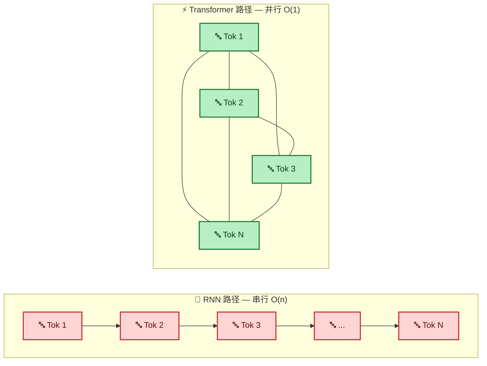

---

## 2. 整体架构总览

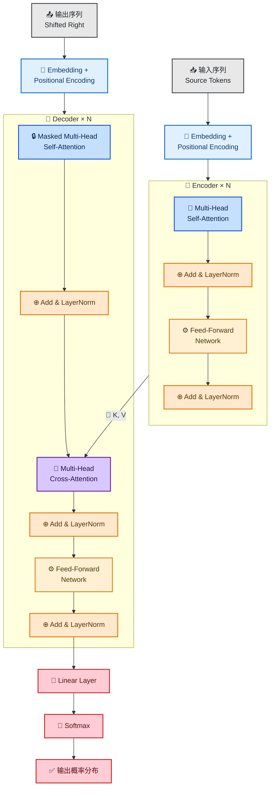

> [!info] 关键数字（原始论文）
> - 层数 $N = 6$（Encoder 和 Decoder 各 6 层）
> - 模型维度 $d_{\text{model}} = 512$
> - 注意力头数 $h = 8$
> - FFN 隐藏层维度 $d_{ff} = 2048$

---

## 3. Self-Attention 自注意力机制

### 3.1 直观理解

> Self-Attention 让序列中的**每个词**都能“看到”序列中**所有词**，并根据相关性加权聚合信息。

比如句子 **“The cat sat on the mat because it was tired”** —— Self-Attention 能让模型知道 `it` 和 `cat` 最相关，而不是 `mat`。

### 3.2 Q、K、V 三剑客

每个 token 的 embedding 通过三个不同的线性变换，分别产生：

| 向量            | 全称  | 含义                          |
| :------------ | :-- | :-------------------------- |
| **Q** (Query) | 查询  | “我在找什么？”——当前 token 想要关注什么信息 |
| **K** (Key)   | 键   | “我是什么？”——每个 token 提供的信息标签   |
| **V** (Value) | 值   | “我有什么？”——每个 token 携带的实际内容   |

### 3.3 计算步骤

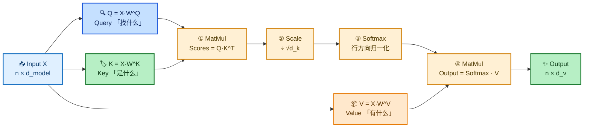

#### 数学公式

$$
\text{Attention}(Q, K, V) = \text{softmax}\!\left(\frac{QK^T}{\sqrt{d_k}}\right) V
$$

> [!note] 为什么要除以 $\sqrt{d_k}$？
> 当 $d_k$ 较大时，点积 $QK^T$ 的值会很大，经过 Softmax 后梯度会变得极小（饱和区）。除以 $\sqrt{d_k}$ 可以**控制方差**，保持梯度稳定。

### 3.4 计算示例

$$
\underbrace{\begin{bmatrix} q_1 \\ q_2 \\ \vdots \\ q_n \end{bmatrix}}_{n \times d_k}
\times
\underbrace{\begin{bmatrix} k_1^T & k_2^T & \cdots & k_n^T \end{bmatrix}}_{d_k \times n}
= \underbrace{\begin{bmatrix}
s_{11} & s_{12} & \cdots & s_{1n} \\
s_{21} & s_{22} & \cdots & s_{2n} \\
\vdots & \vdots & \ddots & \vdots \\
s_{n1} & s_{n2} & \cdots & s_{nn}
\end{bmatrix}}_{n \times n \text{ 注意力矩阵}}
$$

> 注意力矩阵的每一行表示：**该位置的 token 对序列中所有 token 的关注权重**（和为 1）。

---

## 4. Multi-Head Attention 多头注意力

### 4.1 为什么需要多头？

> 单头注意力只能捕获**一种**关系模式。**多头**并行运行多个独立的 Self-Attention，每个头关注不同的子空间，最后拼接起来。

比如：
- Head 1 → 主谓关系
- Head 2 → 修饰关系
- Head 3 → 指代关系
- Head 4 → 长距离依赖

### 4.2 计算流程

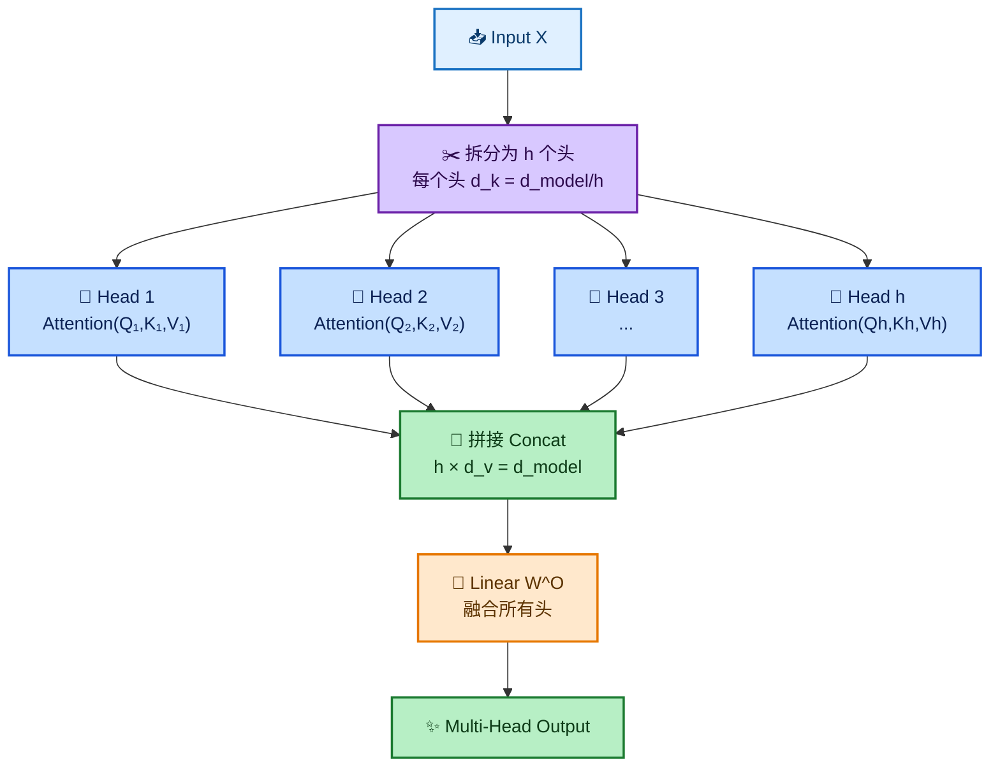

#### 公式

$$
\begin{aligned}
\text{MultiHead}(Q, K, V) &= \text{Concat}(\text{head}_1, \ldots, \text{head}_h) \, W^O \\[4pt]
\text{head}_i &= \text{Attention}(Q W_i^Q,\; K W_i^K,\; V W_i^V)
\end{aligned}
$$

> [!tip] 维度变化
> 每个头的 $d_k = d_v = d_{\text{model}} / h = 512 / 8 = 64$
>
> 拼接后恢复为 $d_{\text{model}} = 512$，再经 $W^O \in \mathbb{R}^{512 \times 512}$ 融合。

---

## 5. Positional Encoding 位置编码

### 5.1 为什么需要？

> Self-Attention 是**置换等变（permutation equivariant）**的——打乱输入顺序，输出也相应打乱，但值不变。Transformer **没有内置的序列顺序概念**，必须显式注入位置信息。

### 5.2 正弦/余弦位置编码（原始论文）

$$
\begin{aligned}
PE_{(pos,\, 2i)} &= \sin\!\left(\frac{pos}{10000^{2i / d_{\text{model}}}}\right) \\[6pt]
PE_{(pos,\, 2i+1)} &= \cos\!\left(\frac{pos}{10000^{2i / d_{\text{model}}}}\right)
\end{aligned}
$$

| 符号 | 含义 |
|:---|:---|
| $pos$ | token 在序列中的位置 |
| $i$ | 维度的索引（$0 \sim d_{\text{model}}/2 - 1$） |
| $10000^{2i/d}$ | 频率，维度越高变化越慢 |

> [!note] 为什么用 sin/cos？
> 1. **可外推**：即使训练时没见过更长的序列，也能生成新的位置编码
> 2. **相对位置可学习**：$PE_{pos+k}$ 可以表示为 $PE_{pos}$ 的线性函数
> 3. **值域稳定**：始终在 $[-1, 1]$ 之间

> [!info] 位置编码的注入方式
> $$
> X_{\text{final}} = \text{Embedding}(token) + PE(pos)
> $$
> 直接将位置编码**加**到词嵌入上，而非拼接。

### 5.3 其他位置编码方式

| 类型 | 代表 | 特点 |
|:---|:---|:---|
| **可学习位置编码** | BERT, ViT | 将位置视为可训练参数；限制最大长度 |
| **相对位置编码** | Transformer-XL, T5 | 编码 token 之间的相对距离，而非绝对位置 |
| **旋转位置编码 (RoPE)** | LLaMA, Qwen, ChatGLM | 通过旋转矩阵施加位置信息，是目前最主流方案 |

---

## 6. Feed-Forward Network 前馈网络

### 6.1 结构与公式

$$
\text{FFN}(x) = \max(0,\, xW_1 + b_1)\, W_2 + b_2
$$

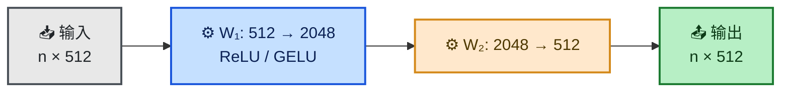

> 原始论文用 ReLU；后续变体（如 GPT）常用 **GELU** 或 **SwiGLU**。

### 6.2 FFN 的作用

| 角色        | 说明                                            |
| :-------- | :-------------------------------------------- |
| **非线性变换** | Self-Attention 本质是线性的加权求和，FFN 引入非线性           |
| **知识存储**  | 研究表明 FFN 层存储了大量**事实性知识**（类似 Key-Value Memory） |
| **逐位置处理** | 对每个位置的 token **独立**作用（可并行）                    |

> [!tip] 可以把 FFN 理解为一个「两层的全连接网络」，在 Attention 聚合完上下文信息后，对每个 token 的表征做进一步的深度加工。

---

## 7. 残差连接 & Layer Normalization

### 7.1 残差连接 (Residual Connection)

$$
\text{Output} = \text{LayerNorm}\big(x + \text{Sublayer}(x)\big)
$$

> 将子层输入 $x$ 直接加到输出上，再送入 LayerNorm。

**作用**：
- ✅ 解决深层网络的**梯度消失**问题
- ✅ 让模型更容易优化（恒等映射作为“保底”）
- ✅ 即使 Attention 或 FFN 学坏了，信息仍能通过残差通路传播

### 7.2 两种 Norm 位置

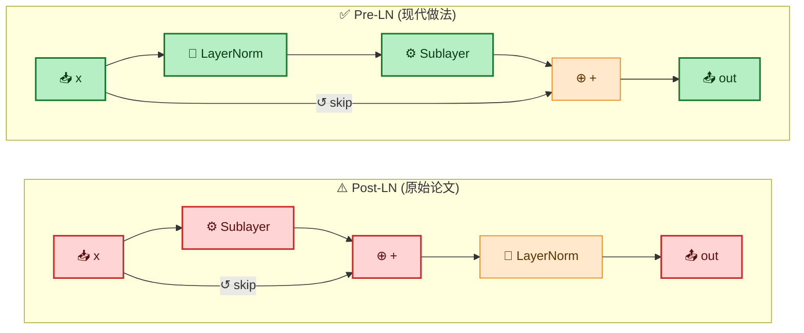

| 方式 | 使用 | 特点 |
|:---|:---|:---|
| **Post-LN** | 原始 Transformer | 训练不稳定，需要 warm-up |
| **Pre-LN** | GPT, LLaMA 等 | 训练更稳定，无需 warm-up |

> [!warning] Post-LN 的问题
> 原始论文的 Post-LN 在深层网络中容易出现**梯度发散**，因此后来的大模型几乎都改用了 Pre-LN。

### 7.3 Layer Normalization

$$
\text{LayerNorm}(x) = \gamma \cdot \frac{x - \mu}{\sigma} + \beta
$$

> 与 BatchNorm 不同，LayerNorm 在每个样本的**特征维度**上做归一化，不依赖 batch 统计量，适合变长序列和 NLP 任务。

| | BatchNorm | LayerNorm |
|:---|:---|:---|
| 归一化维度 | Batch 维度 | Feature 维度 |
| 依赖 batch size | ✅ 是 | ❌ 否 |
| 适用场景 | CV | NLP / Transformer |

---

## 8. Encoder 编码器

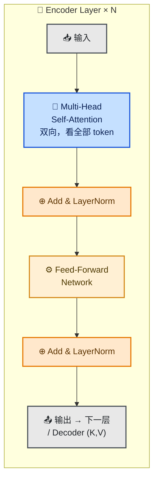

### Encoder 关键特性

| 特性 | 说明 |
|:---|:---|
| **双向** | 每个位置都能看到序列的**所有位置**（不屏蔽） |
| **并行** | 所有 token 同时处理，无时序依赖 |
| **输出** | 产生上下文感知的表示序列，传给 Decoder 的 Cross-Attention |

> [!info] Encoder 的代表模型
> **BERT** 就是纯 Encoder 架构——用双向 Self-Attention 做深度理解，适合分类、序列标注、句子对匹配等**理解任务**。

---

## 9. Decoder 解码器

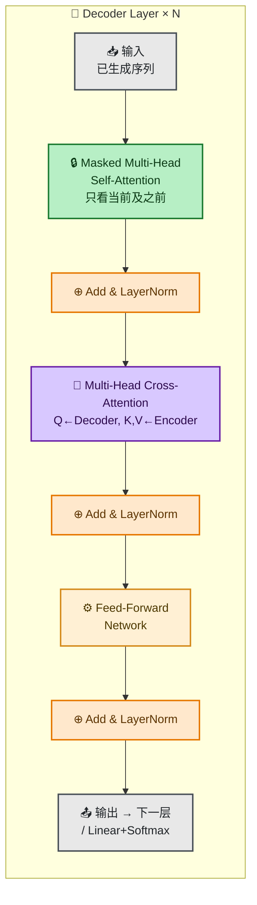

### Decoder 关键特性

| 特性 | 说明 |
|:---|:---|
| **自回归** | 逐 token 生成，当前输出依赖于之前的所有输出 |
| **Masked Self-Attention** | 每个位置只能看到**当前位置及之前**的位置（因果掩码） |
| **Cross-Attention** | Q 来自 Decoder 自身，K 和 V 来自 Encoder 输出（架起编解码桥梁） |

> [!info] Decoder 的代表模型
> **GPT 系列**是纯 Decoder 架构——只用 Masked Self-Attention，去掉 Cross-Attention 和 Encoder，专注于**生成任务**。

---

## 10. Masked Attention & Cross-Attention

### 10.1 Masked Self-Attention（因果掩码）

> 在 Decoder 的自注意力中，通过一个**上三角为 $-\infty$ 的掩码矩阵**，确保生成第 $t$ 个 token 时，只能看到 $1 \sim t$ 位置的信息。

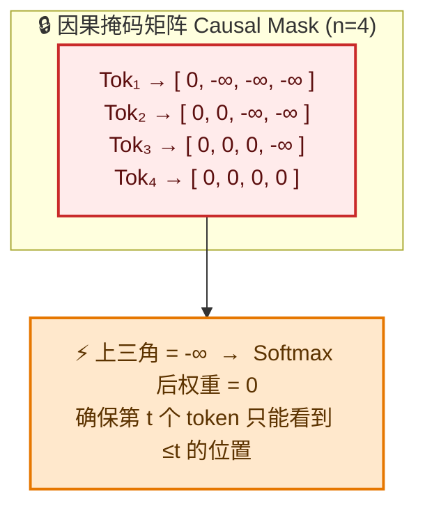

> Softmax 后 $e^{-\infty} = 0$，即**未来 token 的权重被清零**。

### 10.2 Cross-Attention（交叉注意力）

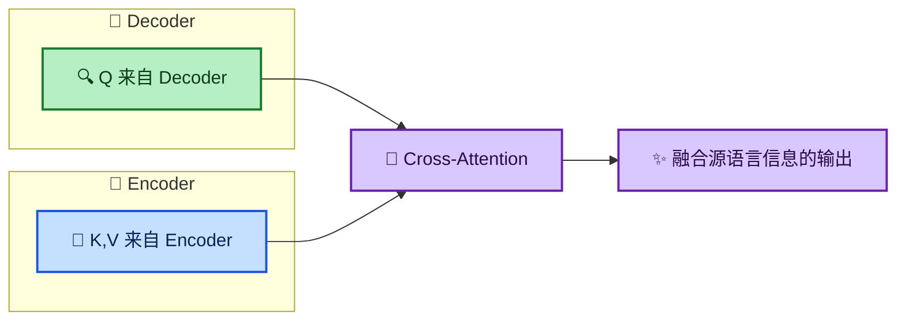

| 对比 | Self-Attention | Cross-Attention |
|:---|:---|:---|
| Q 来源 | 当前层输入 | Decoder 当前层 |
| K, V 来源 | 当前层输入（同一个） | Encoder 最终输出 |
| 作用 | 序列内部信息交互 | 跨序列信息融合 |
| 用途 | Encoder + Decoder 都有 | 仅 Decoder |

> 在机器翻译中，Cross-Attention 让 Decoder 在生成每个目标语言词时，能“瞄一眼”源语言的所有词。

---

## 11. 训练与推理流程

### 11.1 训练阶段

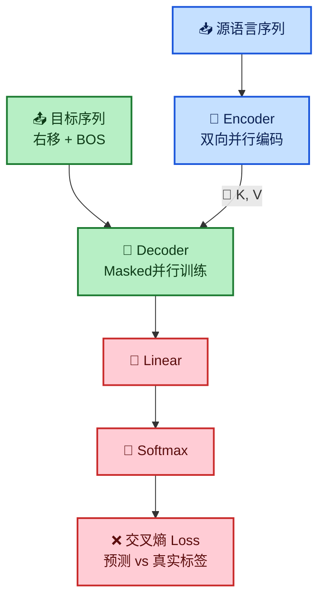

> [!important] Teacher Forcing
> 训练时，Decoder 的输入是**真实的上一 token**（而非模型自己预测的）。这使训练可以并行，但也导致训练和推理的分布不一致（Exposure Bias）。

### 11.2 推理阶段（自回归生成）

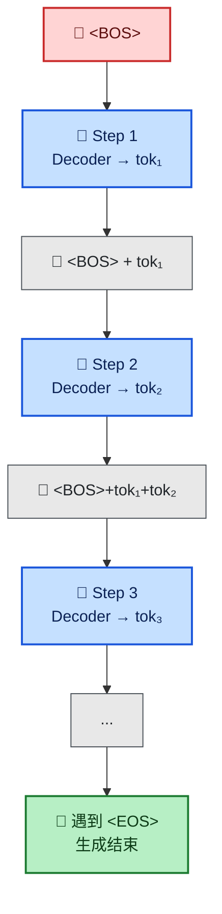

#### 解码策略

| 策略 | 方法 | 特点 |
|:---|:---|:---|
| **Greedy** | 每步选概率最大的 token | 简单快速，但容易陷入重复 |
| **Beam Search** | 保留 top-k 条候选路径 | 平衡质量与效率 |
| **Top-k Sampling** | 从概率最高的 k 个中采样 | 增加多样性 |
| **Top-p (Nucleus)** | 累积概率达到 p 时截断采样 | 动态调整候选数量 |
| **Temperature** | 调节 Softmax 的平滑程度 | 高→多样，低→确定 |

---

## 12. 与其他架构对比

### 12.1 全面对比

| 维度 | RNN / LSTM | CNN (Text) | Transformer |
|:---|:---|:---|:---|
| **并行计算** | ❌ 串行 | ✅ 并行 | ✅ 完全并行 |
| **长距离依赖** | ⚠️ LSTM 缓解但仍有限 | ❌ 需堆叠很多层 | ✅ $O(1)$ 路径 |
| **训练速度** | 🐢 慢 | 🐇 快 | 🐇 最快 |
| **参数量** | 较小 | 中等 | 大（可扩展） |
| **序列建模能力** | 天然适合 | 局部模式 | 全局交互 |
| **位置信息** | 内置（时序） | 局部感受野 | 需额外编码 |
| **可解释性** | 一般 | 较好 | ⭐ 注意力可视化 |
| **推理速度** | 逐 token，慢 | 快 | 逐 token（KV Cache 加速） |

### 12.2 架构图谱

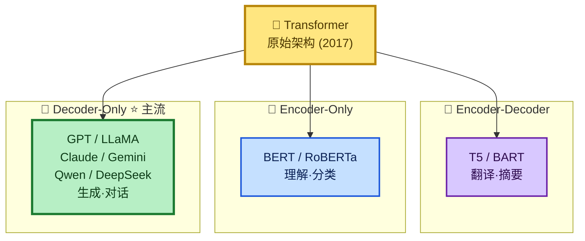

> 当今几乎所有大语言模型（GPT-4、Claude、Gemini、LLaMA、Qwen、DeepSeek 等）都是 **Decoder-Only** 架构的 Transformer 变体。

---

## 13. 变体与演进

### 13.1 重要变体一览

| 年份 | 模型 / 技术 | 核心创新 |
|:---|:---|:---|
| 2017 | **Transformer** (原始) | Self-Attention + Multi-Head |
| 2018 | **BERT** | 双向 Encoder，MLM 预训练 |
| 2018 | **GPT** | 单向 Decoder，自回归预训练 |
| 2019 | **Transformer-XL** | 段级递归 + 相对位置编码 |
| 2019 | **XLNet** | 排列语言模型，结合自回归与自编码 |
| 2020 | **GPT-3** | 规模扩展，In-Context Learning |
| 2021 | **RoPE** | 旋转位置编码（LLaMA / Qwen 等采用） |
| 2022 | **FlashAttention** | IO-aware 算法，大幅降低显存与加速 |
| 2023 | **GQA / MQA** | 多查询/分组查询注意力，减少 KV Cache |
| 2024+ | **MoE** | 稀疏混合专家，扩大容量不增加计算 |
| 2024+ | **Mamba / SSM** | 状态空间模型，线性复杂度替代 Attention |

### 13.2 关键优化技术

> [!tip] **FlashAttention**
> 通过分块计算 + 重计算策略，将 Attention 的 IO 复杂度从 $O(N^2)$（显存读写）降到近似 $O(N)$。**几乎所有现代 LLM 都使用。**

> [!tip] **GQA (Grouped Query Attention)**
> 多个 Query 头共享同一组 Key/Value 头，大幅减少推理时的 **KV Cache** 大小。LLaMA 2/3 使用。

> [!tip] **SwiGLU**
> 用 $\text{Swish}(xW_1) \odot (xW_2)$ 替代 ReLU，提升 FFN 的表达能力。LLaMA 等采用。

---

## 14. 总结

### 核心思想三句话

1. **Self-Attention 替代循环**——实现全局并行，$O(1)$ 路径长度
2. **多头 + 残差 + LayerNorm**——稳定训练，多角度建模
3. **位置编码注入顺序**——弥补 Attention 本身的无序性

### 一图胜千言

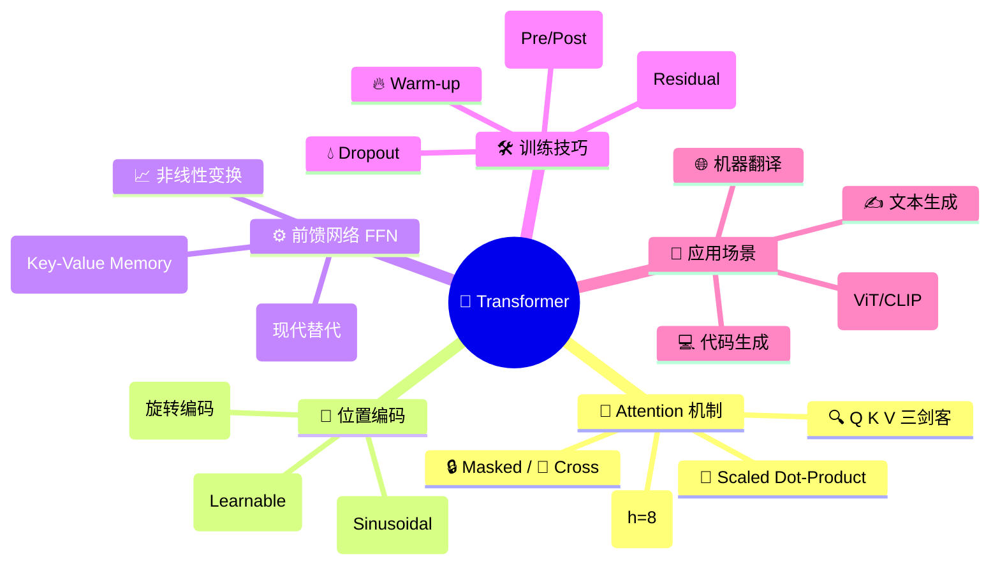

> [!quote] Attention Is All You Need
> *"The dominant sequence transduction models are based on complex recurrent or convolutional neural networks... We propose a new simple network architecture, the Transformer, based solely on attention mechanisms."*
>
> — Vaswani et al., 2017

---

## 参考资源

- 📄 **原始论文**：[Attention Is All You Need](https://arxiv.org/abs/1706.03762)
- 📘 **图解 Transformer**：[The Illustrated Transformer – Jay Alammar](https://jalammar.github.io/illustrated-transformer/)
- 📘 **The Annotated Transformer**：[Harvard NLP](https://nlp.seas.harvard.edu/2018/04/03/attention.html)
- 🎥 **3Blue1Brown 注意力可视化**：[YouTube](https://www.youtube.com/watch?v=eMlx5fFNoYc)
- 📄 **FlashAttention**：[arXiv:2205.14135](https://arxiv.org/abs/2205.14135)
- 📄 **RoPE**：[arXiv:2104.09864](https://arxiv.org/abs/2104.09864)
