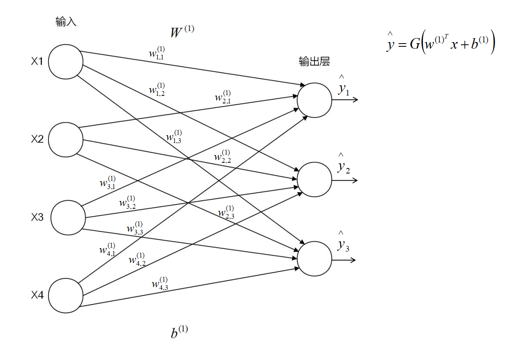

B站：[面试中容易露馅的问题：大模型的训练和推理吃多少显存？_哔哩哔哩_bilibili](https://www.bilibili.com/video/BV1aawjzpEmS)
# 显存估算
---
- 推理阶段
- 训练阶段
- 强化学习（后续再学）
- LoRA（后续再学）
- MoE（后续再学）
---
## 1.推理阶段
- 权重
- KV cache
> [!tip] 计算机基础知识 
 最基本的单位为字节（Byte）
1 字节= 8 位
 2 字节 = 16 位 ——格式：①FP16，②BF16 
 4 字节 = 32 位
 高阶一些的还有量化：4bit量化 = 4位 = 0.5字节
### 权重
 现在训练模型以16位（2字节）为主
 
1KB = 1000B = 1000
1MB = 1000KB = 100万
1GB = 1000MB = 10亿 = 1 B（Billion：十亿）

7B的模型 对应的 是70亿 的参数量
1兆的模型 对应的 是100万 的参数量

> [!tip] 计算
> 7B模型——70亿个参数
一个参数占用两个字节
则这个模型有：70 x 2 = 140亿个字节
140亿个字节 对应 140G/10G = 14G 显存
^2e06aa
### Kvcache
> [!question] 1个token占多少显存：
> 2 x L x H x 2

2 —— k,v两个参数（爱因斯坦方程，Transoformer论文里的公式参数）
L —— Layers，7B模型为例，一般为 32 层
H —— HiddenSize，4096的嵌入维度
2 —— FP16/BF16占两个字节

2 x 32 x 4096 x 2 = 52488B = 0.5MB —— 1个token

如果有 4096 个 token，batchsize=2
0.5MB x 4096 x 2 = 4 G 显存 则够

--- 
## 2.训练阶段
- 静态显存
- 动态显存

> [!note] 总显存 = 静态显存 + 动态显存
> 
^11cf60
### ①静态显存
> [!tip] 静态显存=权重 + 梯度 + 优化器

^16134a

以7B模型为例
上面已经计算过其权重为[14G](#^2e06aa)（16位）

一个权重对应一个梯度
所以梯度显存为14G（16位）

> [!tip] 优化器（Adam）= 权重 + 一阶动量 + 二阶动量

^b6e9dc

优化器是以32位来存储的，所以这里的权重要乘2
权重 = 28G，一阶动量 = 28G，二阶动量 = 28G

静态显存 = 14 + 14 + 28 + 28 + 28 = 112 G
7 x 16 = 112 G
#经验公式（速算）：静态显存 = 模型参数量 x 16
现在有许多优化，所以不一定是14G和24G，可能会优化到14G以内

### ②动态显存
动态显存就是激活值

> [!note]- 每一层的激活值也要被记录下来，因为在反向传播的时候，需要计算导数和梯度，需要用到每一层的激活值，既然需要用到激活值，所以激活值也要写入到显存中去
>一个4096token长度的输入，占用的激活值大概40G左右

根据总显存[计算公式](#^11cf60)，得到需要（112 + 40）G = 152G显存
### 优化方法：
有一些优化方法——比如 #梯度检查点
我们每一层都要去存储激活值，梯度检查点——不需要去存，典型的以时间换空间的方法，显著增加推理时间
比如第一层的激活值存下来了，但是第二层的激活值就不用存了，只需要等需要用的时候现场去推，把第一层的结果乘以参数矩阵，得到第二层的激活值，就不需要这么多显存了，但是相应的带来的缺陷就是：现场推导会影响模型训练时间

 
 
 

[^1]: 
