B站：[模型剪枝核心原理！模型剪枝算法和流程介绍！Model Pruning深度解析【推理引擎】模型压缩系列第05篇_哔哩哔哩_bilibili](https://www.bilibili.com/video/BV1y34y1Z7KQ/)

--- 
# Ⅰ、模型剪枝
- Difference between pruning and quantification - 剪枝与量化的区别
- Classification of pruning methods - 剪枝算法分类
- Pruning process - 剪枝流程
- L1norm based Channel Pruning - L1-norm 剪枝算法

## 1、剪枝与量化的区别
模型压缩提出了三部分优化：
1）减少内存密集的访问量 —— 减少跟内存的访问次数，访问次数越少越好
2）提高获取模型参数的时间 —— 模型参数越少越好，模型越小越好
3）加速推理时间 —— 在推理的情况下把真正的时延 提上去
无论是剪枝还是量化都属于模型压缩

### B站：[模型剪枝核心原理！模型剪枝算法和流程介绍！Model Pruning深度解析【推理引擎】模型压缩系列第05篇_哔哩哔哩_bilibili](https://www.bilibili.com/video/BV1y34y1Z7KQ/)

--- 
# Ⅰ、模型剪枝
- Difference between pruning and quantification - 剪枝与量化的区别
- Classification of pruning methods - 剪枝算法分类
- Pruning process - 剪枝流程
- L1norm based Channel Pruning - L1-norm 剪枝算法

## 1、剪枝与量化的区别
模型压缩提出了三部分优化：
1）减少内存密集的访问量 —— 减少跟内存的访问次数，访问次数越少越好
2）提高获取模型参数的时间 —— 模型参数越少越好，模型越小越好
3）加速推理时间 —— 在推理的情况下把真正的时延 提上去
无论是剪枝还是量化都属于模型压缩

具体区别：
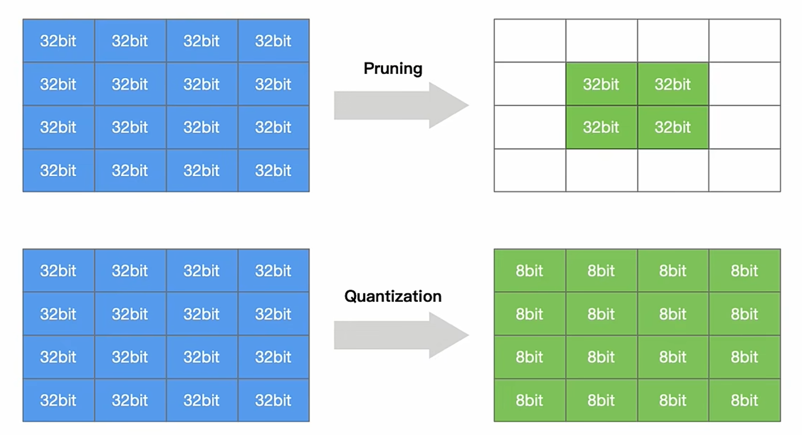

#### 量化
原始数据均为 32bit（FP32） 经过 Quatization 后 ，存储 的 数据 就变成 8bit或者int8
在实际网络模型量化推理的时候，如果硬件支持8bit运算的指令集，则8bit的数据就能够在真正的硬件上部署起来
#### 剪枝
 剪枝则是在训练或推理的时候，将数据剪掉（主要是加速推理，训练虽然有意义，但是推理更重要，因为训练只需要生成参数即可，推理是实际应用参数）,所以模型加速推理有得做
一些不重要的或者冗余的非关键的权重或者数据剪掉，重要的token留下来

但是两者的目标相同，只是手段不同
## 剪枝
### To prune,or not to prune：exploring the efficacy of pruning for model compression
[[1710.01878] To prune, or not to prune: exploring the efficacy of pruning for model compression](https://arxiv.org/abs/1710.01878)
> [!question] Why pruning?

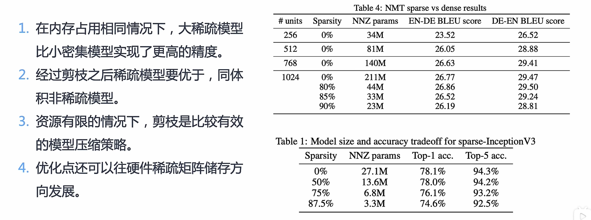
1，2，3条 均是作者做了大量消融实验 得到的 结论

### 剪枝算法的分类
Review
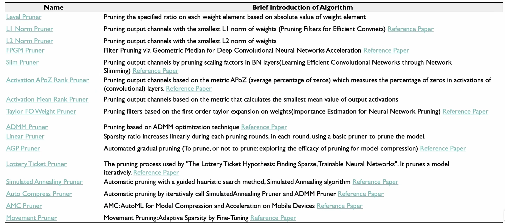

主要有两大类别：
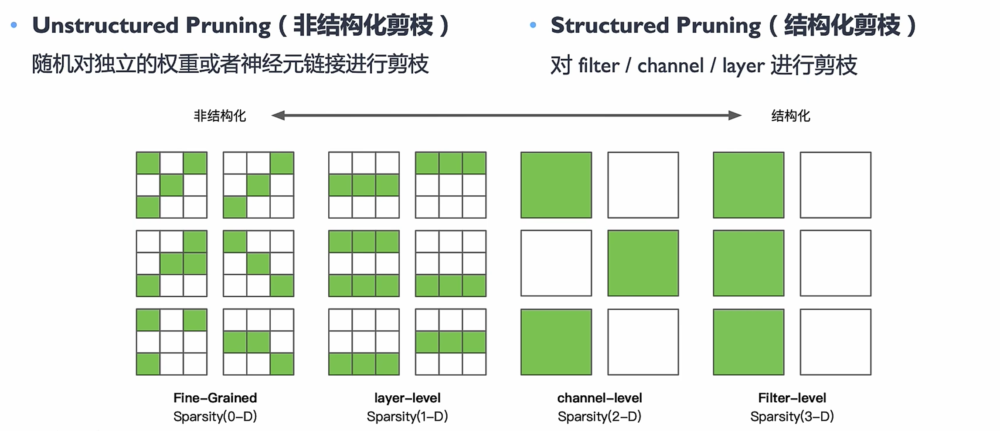
Unstructed Pruning：主要是对一些独立的权重或者神经元，或者神经元的链接进行剪枝，随机的
Structed Pruning：有规律、有顺序对神经网络或者计算图 进行 剪枝
经典：对 layer、channel、Fiter进行 pruning —— 这几种方法 剪枝的维度、剪枝的方式不一样
#### 两种方法的优缺点
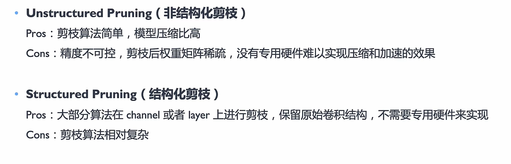
精度不可控 一般 是 不可被接受的 —— 训练一个模型主要就是为了提高其精度，推理的时候精度不可控相当于白训练了，所以 非结构化的 剪枝很少用，没有专用硬件难以实现压缩和加速的效果

> [!quote] weight distribution of CNN layers for different pruning method
[[2004.11627] Convolution-Weight-Distribution Assumption: Rethinking the Criteria of Channel Pruning](https://arxiv.org/abs/2004.11627)

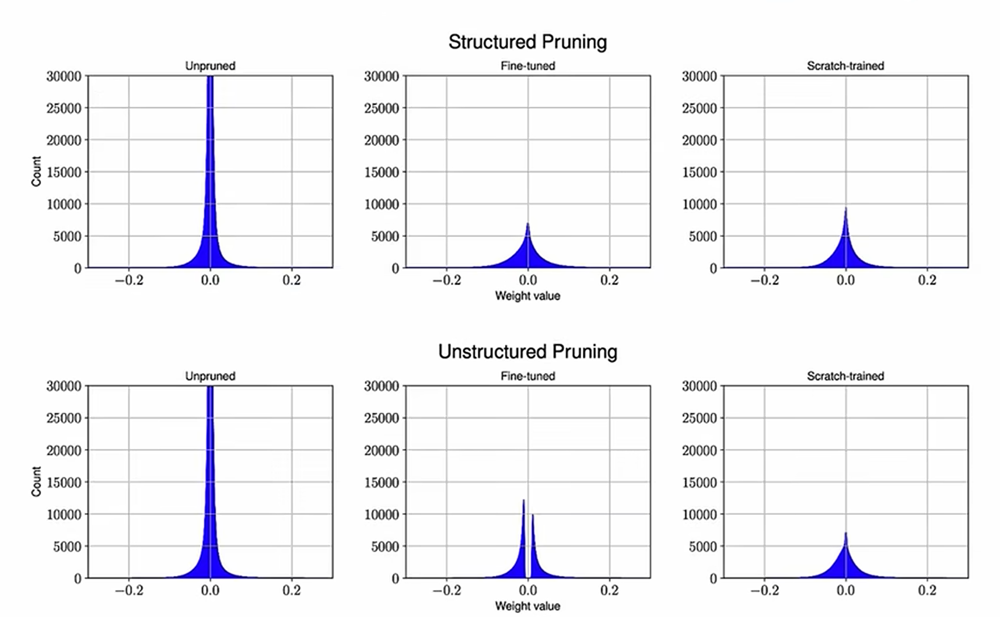
可见，在没有剪枝之前，为0的值较多，剪枝后变得更加均匀，更加符合高斯分布，不要冗余的参数，有这些冗余的参数还不如省点空间

## 剪枝的流程
对模型进行剪枝的三种常见做法：
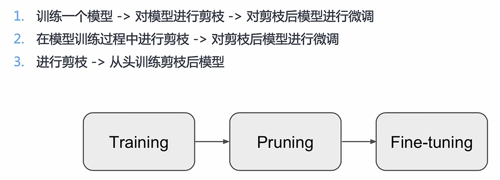
### 不同作用：
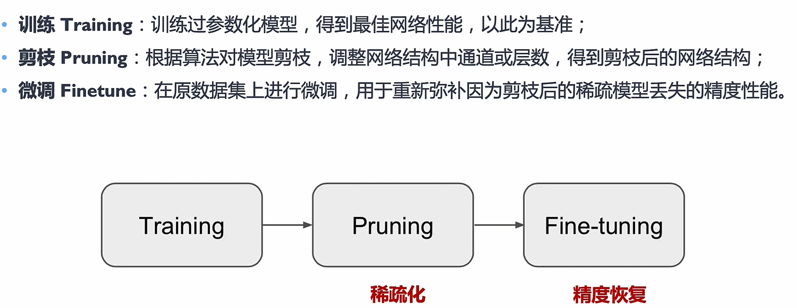
三种方法：
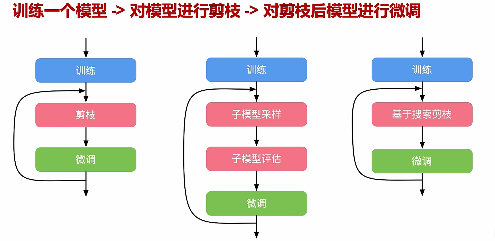
搜索剪枝需要大量的资源

## L1-Norm
L1-Norm based Channel Pruning
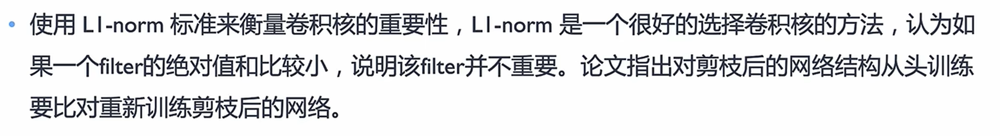
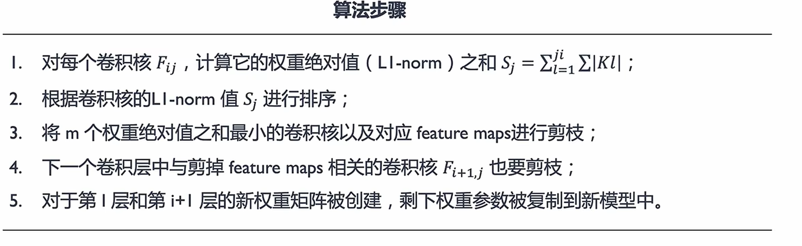
效果：
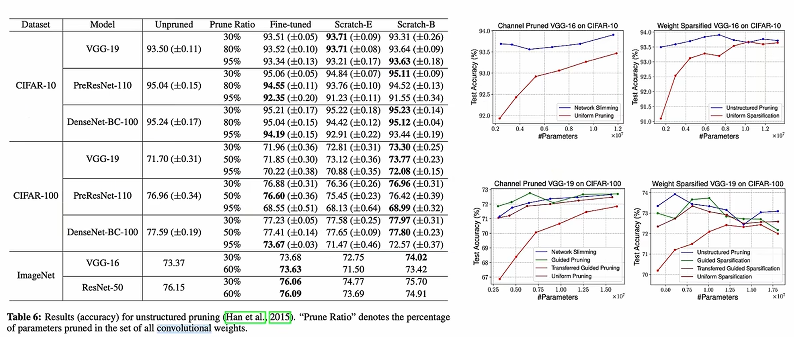
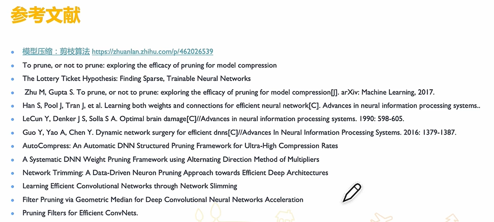
