---
tags:
  - deep-learning
  - object-detection
  - YOLO
  - computer-vision
created: 2026-06-24
aliases:
  - YOLOv2
  - YOLO9000
---

# YOLOv2 / YOLO9000 核心改进手段

> **论文**: *YOLO9000: Better, Faster, Stronger* (CVPR 2017)
> YOLOv2 在 YOLOv1 的基础上引入了一系列改进，在保持实时推理速度的同时大幅提升了检测精度。

# Better
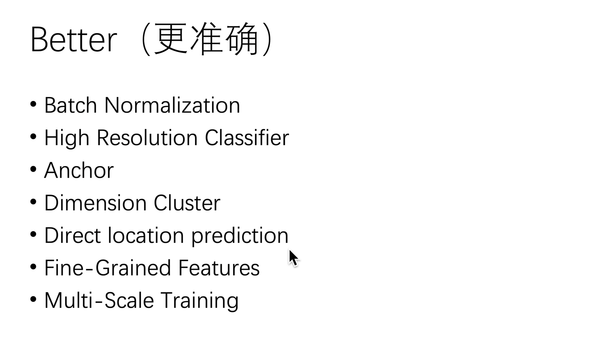

---
## 1. Batch Normalization（BN 层）

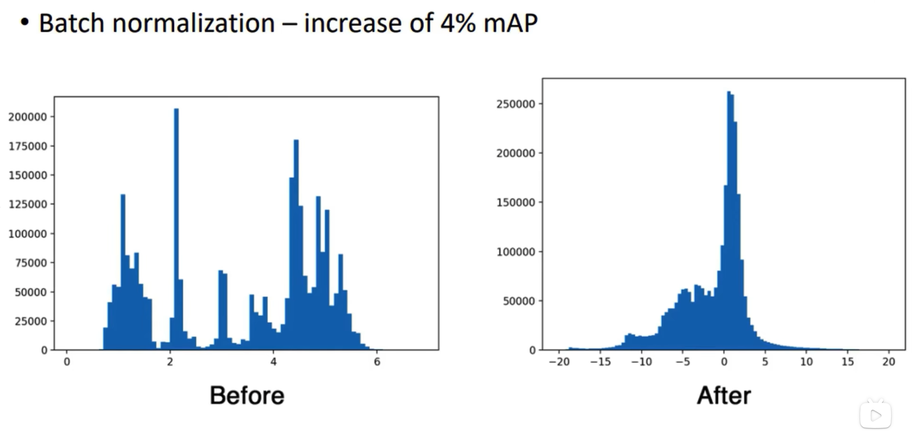

### 1.1 核心思想

对神经元的输出进行归一化：减去均值、除以标准差，使其分布变换为均值 $0$、方差 $1$ 的标准正态分布，从而有效**防止梯度爆炸 / 梯度消失**。

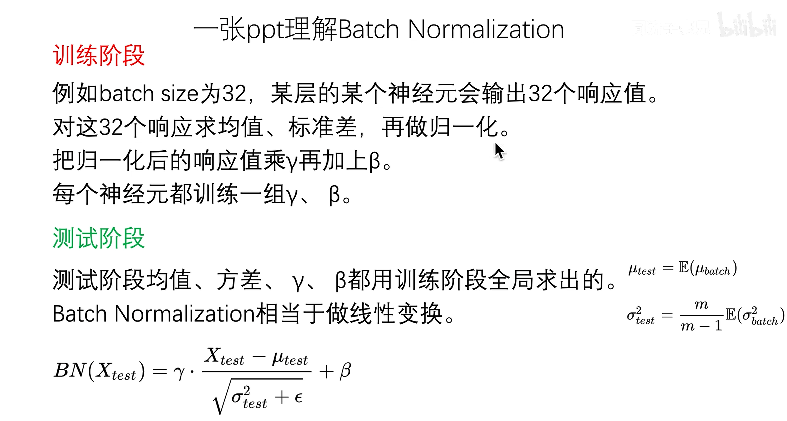

之后引入可学习参数 $\gamma$（缩放）和 $\beta$（平移），以恢复网络的表示能力，弥补归一化带来的信息损失。

### 1.2 训练与测试的差异

- **训练阶段**：以当前 mini-batch 的均值 $\mu_B$ 和方差 $\sigma_B^2$ 进行归一化。
- **测试阶段（推理阶段）**：使用训练过程中累积的**全局移动平均（Running Mean / Running Variance）** 作为均值和方差，等价于一次固定的线性变换，不再依赖 batch 统计量。

> 📌 **补充知识点**：BN 的提出使得网络对参数初始化和学习率的设置更加鲁棒，同时自带一定的正则化效果，加速收敛。

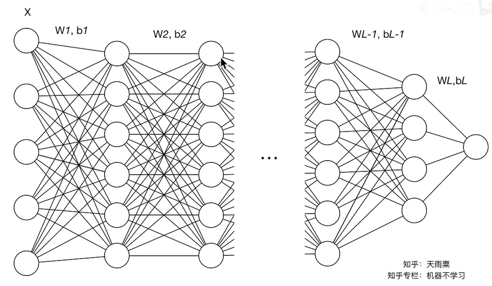

例如，上图中的 MLP 某个神经元，接收 `batch_size=32` 的输入，输出也是 32。神经元内的权重 $w$ 和偏置 $b$ 完成线性变换后，在进入激活函数之前执行 BN：对这 32 个输出值求均值与方差，按 BN 公式计算后作为下一层的输入。

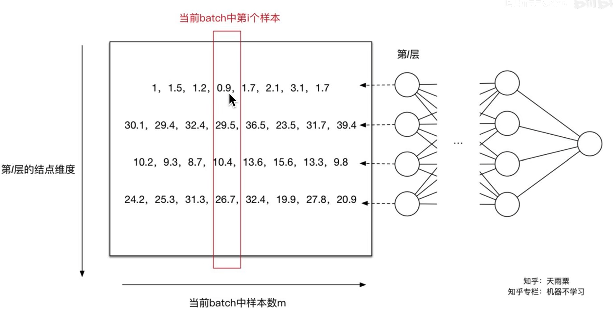

如上图所示，假设有 4 个 Batch，`batch_size=8`，每个特征维度有 8 个值。对第 1 行的 8 个数求均值与方差，再经 $\gamma$、$\beta$ 缩放平移得到 BN 输出；每一行都独立进行此操作，即为 Batch Normalization。

### 1.3 BN 算法流程

> BN 最初在 **Inception V2**（或称 BN-Inception）中提出。

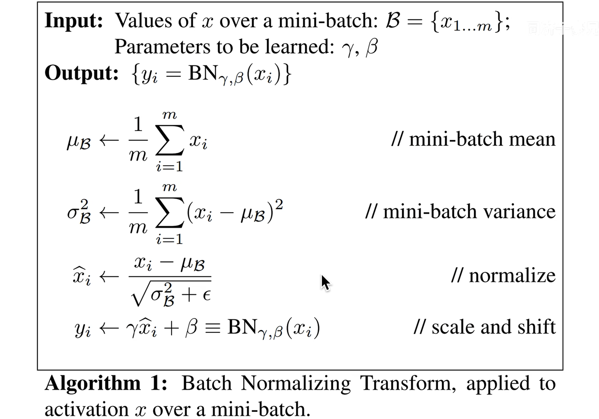

### 1.4 BN 为什么有效

- 将激活值约束在激活函数（如 Sigmoid、Tanh）的**线性敏感区**，避免进入饱和区，缓解梯度消失。
- 平滑优化地形（loss landscape），使得 SGD 更容易收敛。
- 自带轻微正则化效果，因为每个样本的归一化受到同一 batch 内其他样本的影响。

### 1.5 BN 层的位置

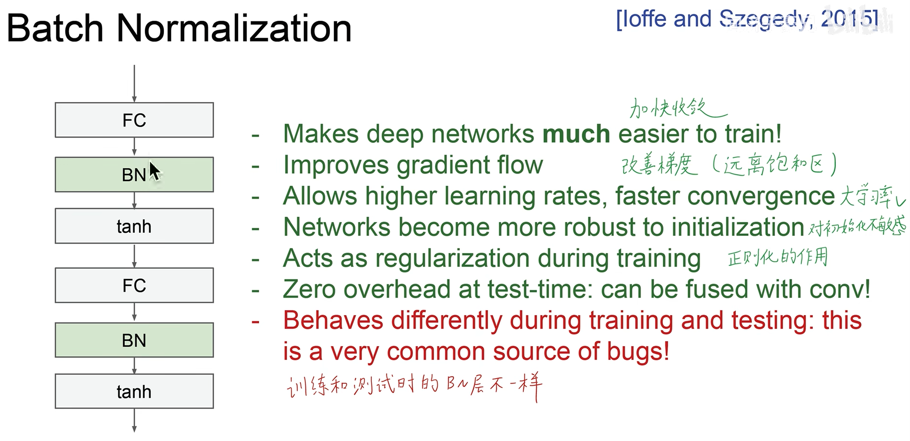

BN 层通常放置在全连接层 / 卷积层之后、激活函数之前：
$$
\text{Linear/Conv} \rightarrow \text{BN} \rightarrow \text{Activation}
$$

### 1.6 BN 与 Dropout 的冲突

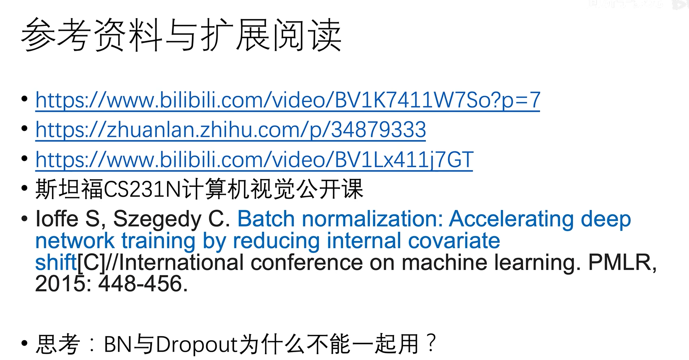

BN 和 Dropout **联合使用时可能产生方差偏移（Variance Shift）**，导致训练与推理的统计量不匹配，使模型性能下降。原因在于：

- BN 依赖固定的 batch 统计分布进行归一化；
- Dropout 随机丢弃神经元，改变了激活值的分布，使得 BN 的均值与方差估计不再稳定；
- 这种训练-推理不一致（train-test discrepancy）会导致性能损失。

> ⚠️ **注意**：并非绝对"不能一起用"，但实践中 BN 本身已有一定的正则化效果，通常建议**优先使用 BN，谨慎叠加 Dropout**。若必须同时使用，可将 Dropout 放在 BN 之后，或降低 Dropout 比率。

---

## 2. High Resolution Classifier（高分辨率分类器）

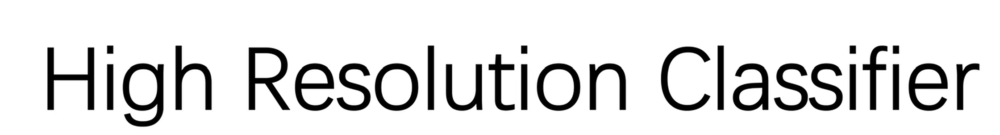

### 2.1 问题

YOLOv1 的分类网络在 **224×224** 的 ImageNet 上预训练，但检测阶段输入分辨率为 **448×448**。模型在检测时需要同时适应分辨率的突变和目标检测任务的学习，导致性能下降。

### 2.2 YOLOv2 的解决方案

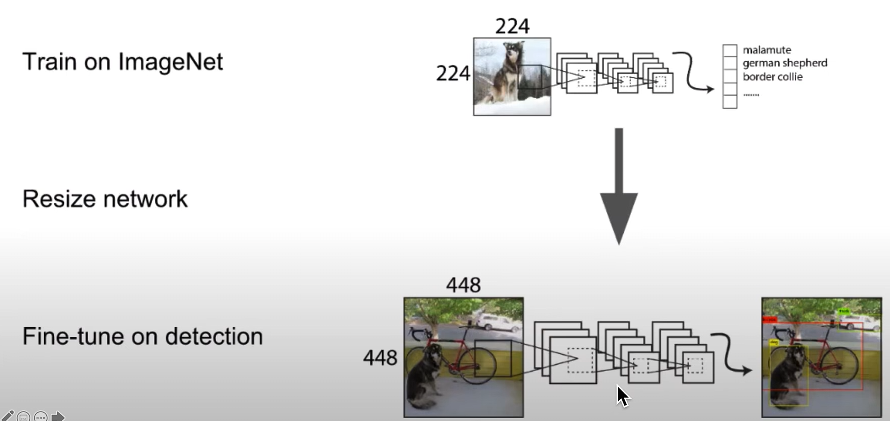

在 ImageNet 上先用 224×224 预训练分类网络，然后将输入分辨率**提升至 448×448，继续微调分类网络 10 个 epoch**，让模型先适应高分辨率输入。最后再在 448×448 分辨率上进行检测任务的微调（fine-tune）。

> 📊 **效果**：这一改动带来了约 **3.5% mAP** 的提升。模型从一开始就适应了高分辨率，避免了 "分辨率突变的阵痛期"。

---

## 3. Anchor Boxes（先验框 / 锚框）

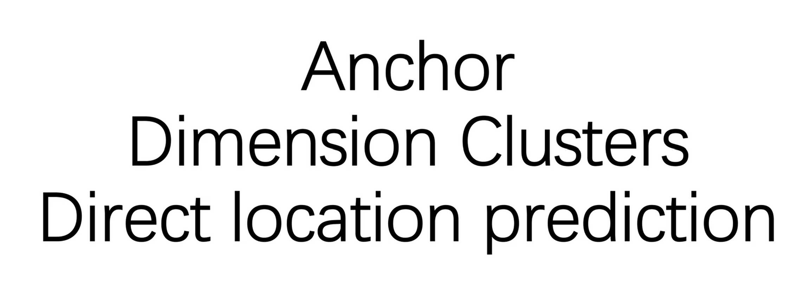

> YOLOv2 是 YOLO 系列中**首次引入 Anchor 机制**的版本，这一设计一直延续到 YOLOv5（YOLOX 之后才有无 Anchor 的探索）。

### 3.1 YOLOv1 的问题：无约束的预测

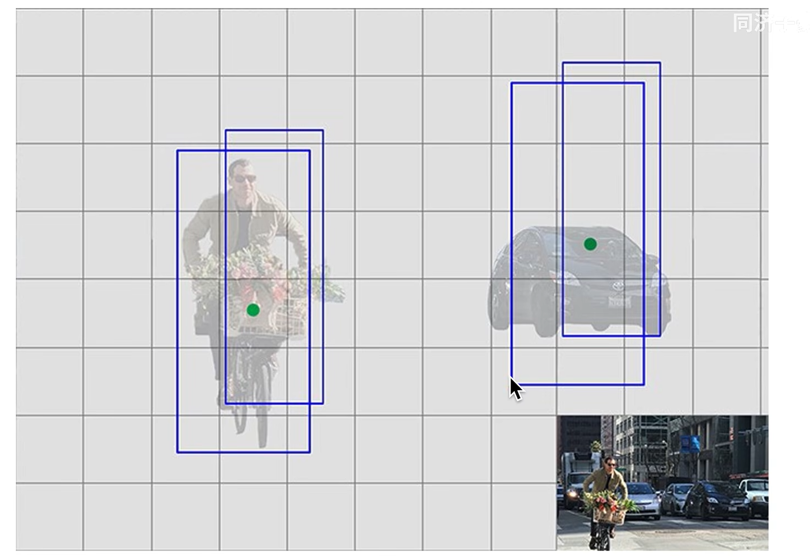

YOLOv1 中，每个 Grid Cell 直接预测 Bounding Box 的坐标 $(x, y, w, h)$，哪个预测框与 Ground Truth 的 IoU 最大，就由哪个框负责拟合。

- ❌ **问题**：预测框的尺寸和位置**没有先验约束**，模型需要在没有任何参考的情况下从零学习各种尺度和长宽比，训练不稳定、收敛慢，即所谓的"野蛮生长"。

### 3.2 Anchor 的核心思想

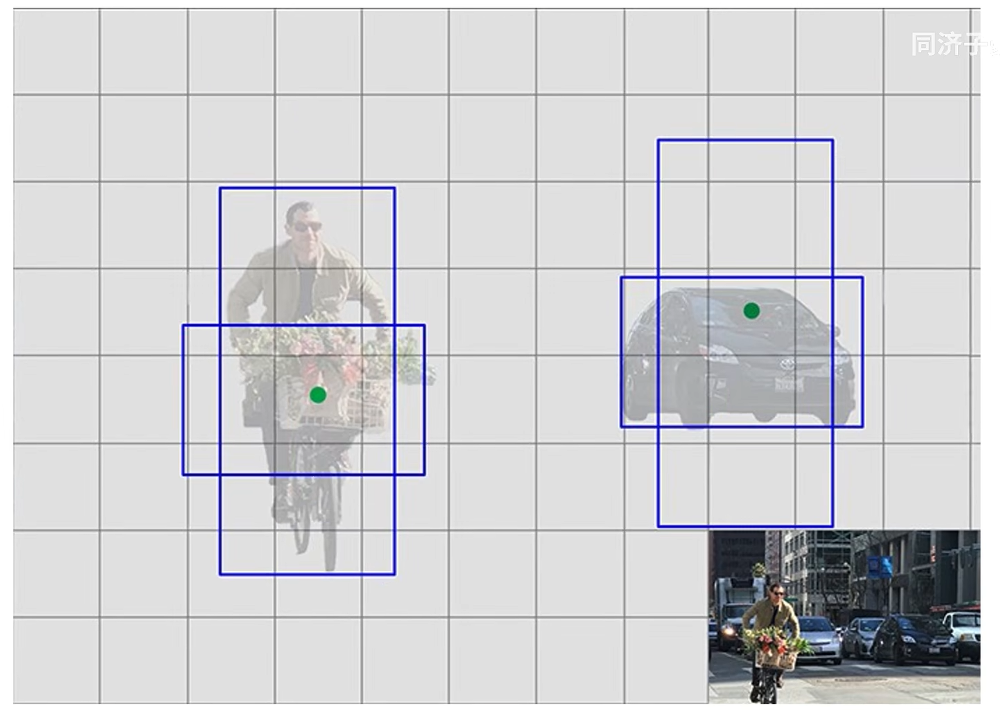

YOLOv2 引入了**一组预定义的先验框（Anchor Boxes）**，具有固定的长宽比和尺度。例如：

- 一个**高瘦的 Anchor** 天生更适合预测行人；
- 一个**矮胖的 Anchor** 天生更适合预测车辆。

**优势**：
- 不同形状的 Anchor 各司其职，**不会相互争抢**，模型更加稳定；
- 网络只需预测**相对于 Anchor 的偏移量（offset）**，而非从零回归完整的边界框坐标，学习难度大幅降低。

### 3.3 Anchor 的工作机制

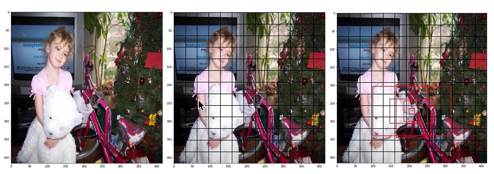

- YOLOv2 将输入图片划分成 **13×13** 的 Grid Cell；
- **每个 Grid Cell 预测 5 个 Anchor**，即预先准备了 5 种不同长宽比的先验框；
- 每个 Anchor 对应一个预测框，预测框只需回归其相对于对应 Anchor 的偏移量。

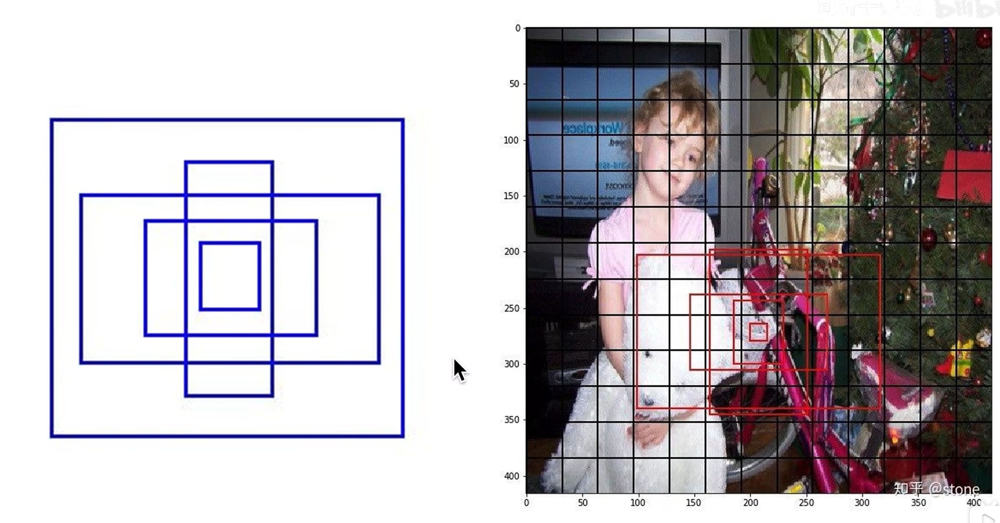

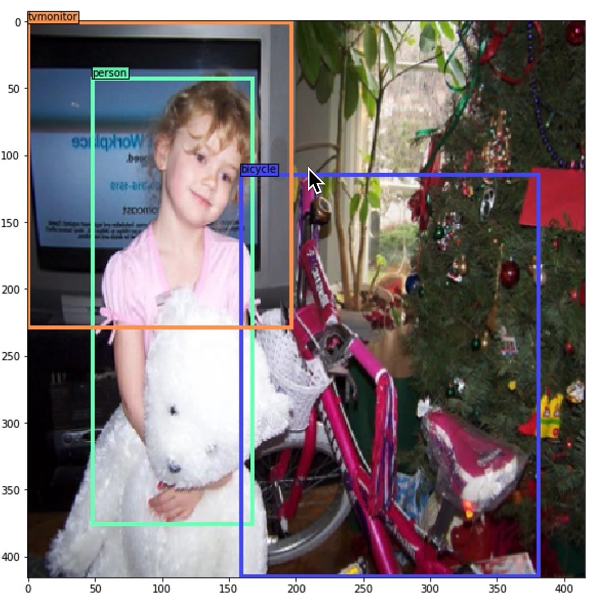

最终，这 5 个带有**先验形状知识**的 Anchor，通过预测的偏移量微调位置和尺寸，即可精确框住目标物体。

### 3.4 正样本匹配策略

以小女孩为例：

- 人工标注的 Ground Truth 中心点落在某个 Grid Cell 中；
- 该 Grid Cell 产生的所有 Anchor 分别与 Ground Truth 计算 IoU；
- **IoU 最大的那个 Anchor** 负责预测该目标，只需输出相对于 Anchor 的偏移量。

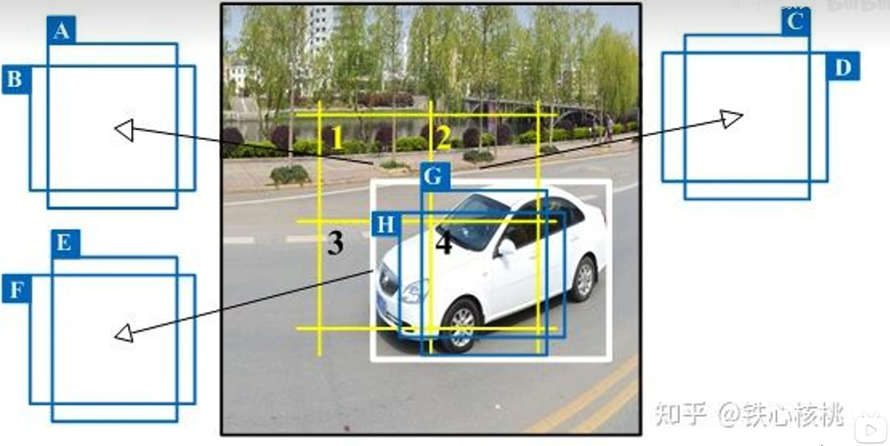

上图中每个 Grid Cell 有 2 个 Anchor（示意），它们与白色框（Ground Truth）计算 IoU，分数较高者负责预测，网络只需学习 Ground Truth 相对于该 Anchor 的偏移即可。

> ⚠️ **重要纠正**：Anchor 的尺寸并非通过"卡尔曼聚类"获得，而是通过 **K-Means 聚类** 对数据集中的 Ground Truth 边界框长宽比进行聚类得到的（详见 §3.8）。

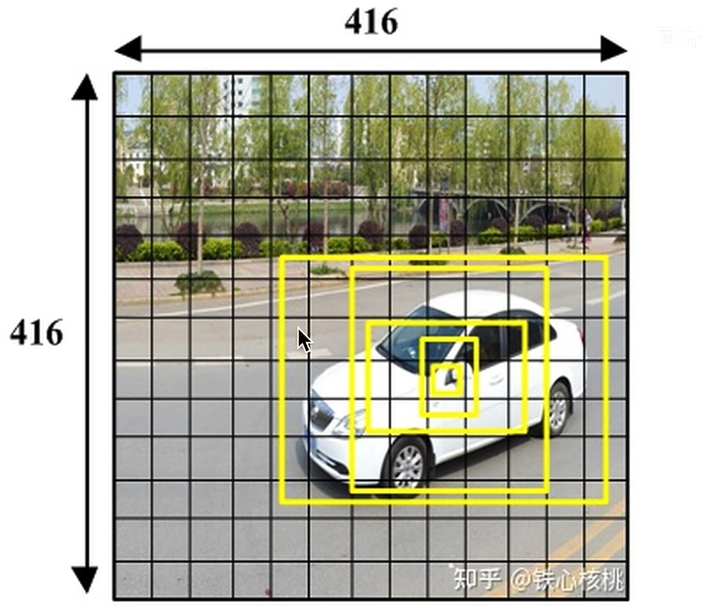

上图展示了 5 个 Anchor 共同预测汽车目标的过程。

### 3.5 奇数 Feature Map 的设计考量

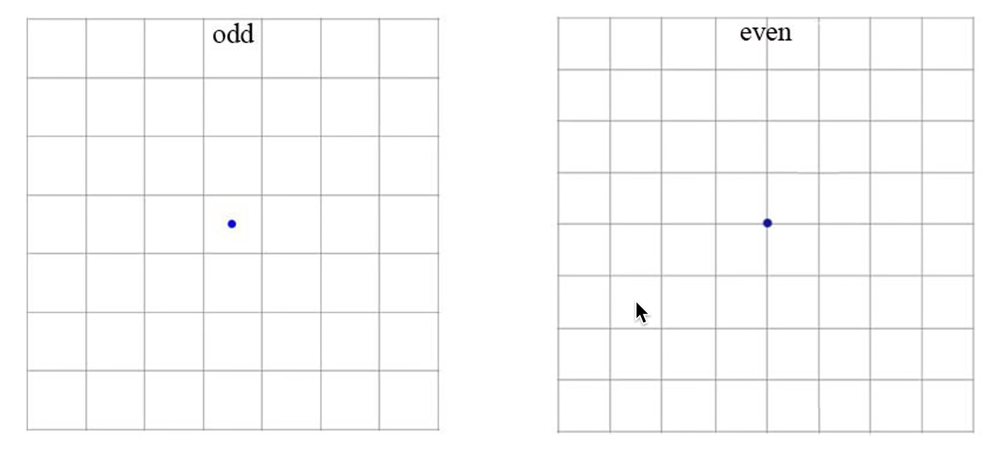

论文中将输出的 Feature Map 尺寸设为**奇数**（如 13×13），原因是：

- 如果一只狗占据了整张图片的中心区域，它的中心点应恰好落在某个确定的 Grid Cell 上；
- 若 Feature Map 为偶数，则中心点落在四个 Grid Cell 的交界处，造成四个 Cell **争抢同一个目标**，训练不稳定；
- **奇数尺寸确保存在唯一的中心 Cell**，使匹配更加优雅和稳定。

### 3.6 输出张量结构

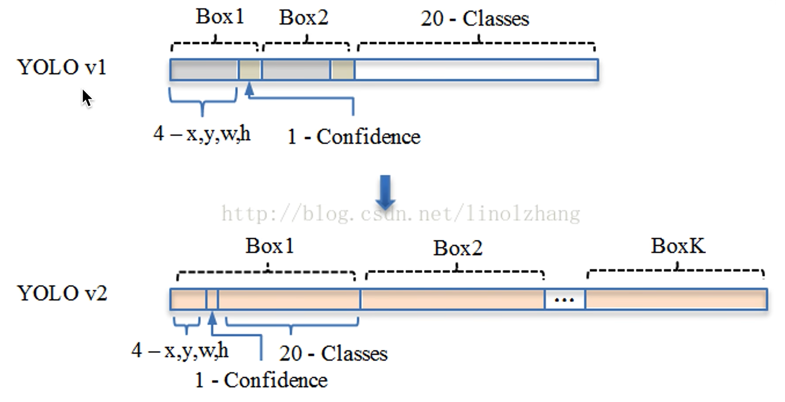

YOLOv2 引入 Anchor 后，输出格式变更如下：

- 图片划分为 **13×13** 个 Grid Cell；
- 每个 Grid Cell 有 **5 个 Anchor**；
- 每个 Anchor 输出：
  - **4 个定位参数**（$t_x, t_y, t_w, t_h$）；
  - **1 个置信度**（Confidence $C$）；
  - **20 个类别概率**（PASCAL VOC 为 20 类）；
- 合计每个 Grid Cell 输出 $5 \times (4 + 1 + 20) = 125$ 个值。

> 在三维空间中，输出张量尺寸为 **13 × 13 × 125**。

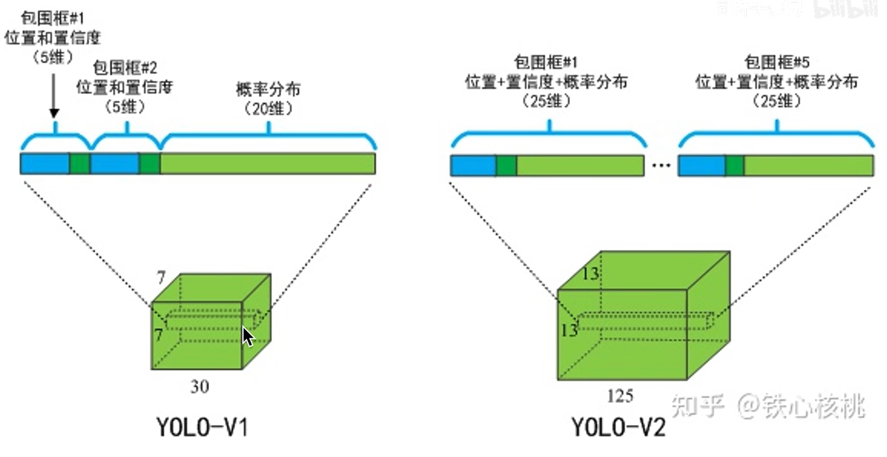

检测结果直接从该张量中解码得到，**无需额外的候选框分类或后处理分支**，真正实现了端到端的目标检测。

### 3.7 通用输出公式

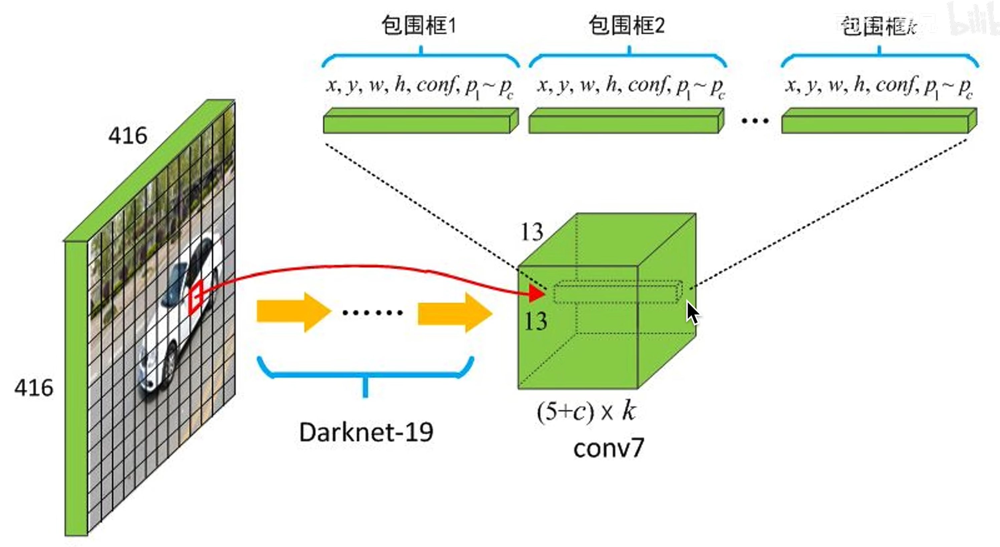

一般地，设 Anchor 个数为 $k$，类别数为 $C$，则每个 Grid Cell 的输出通道数为：
$$
D = k \times (5 + C)
$$

输出张量维度为 $S \times S \times D$（YOLOv2 中 $S=13,\ k=5,\ C=20$）。

### 3.8 为什么是 5 个 Anchor？—— K-Means 聚类选择

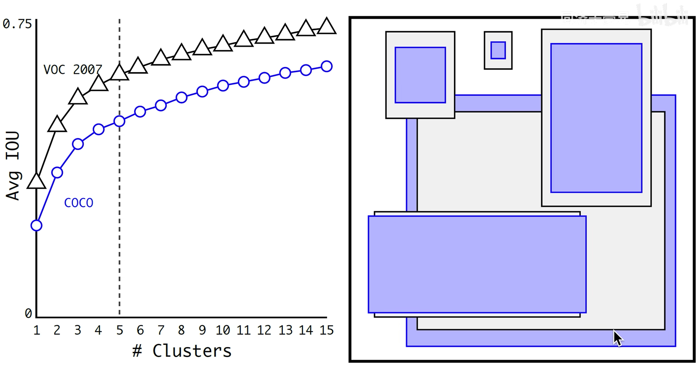

问题：如果数据集中大多数物体都是高瘦形状，但 Anchor 的长宽比不符合这种分布，模型就难以高效拟合。

**解决方案**：对 **PASCAL VOC** 和 **COCO** 数据集中所有 Ground Truth 边界框的长宽比进行 **K-Means 聚类**，用聚类中心作为 Anchor 的预设长宽比。

- 聚类中心越多（即 Anchor 数量越多），能覆盖的 IoU 越高；
- 但 Anchor 越多，计算量和模型复杂度也越大；
- **折中取 5 个 Anchor**，在精度和效率之间取得平衡。

> 从右图可以看到，COCO 数据集的长宽比分布更加多样化。

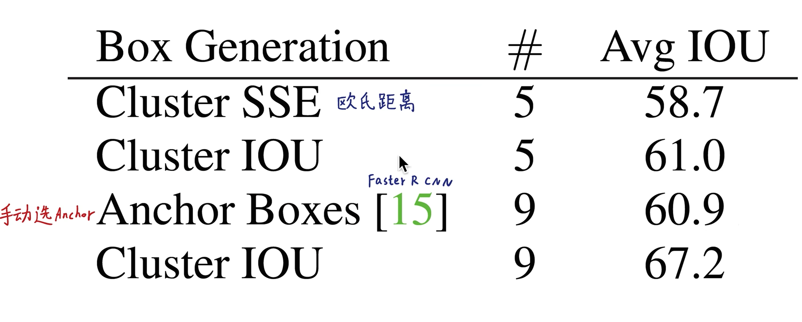

实验结果：**聚类选出的 5 个 Anchor 达到了与手动设定 9 个 Anchor 相当的成绩**，说明基于数据的聚类方法远优于人工经验选择。

### 3.9 Direct Location Prediction（直接位置预测）

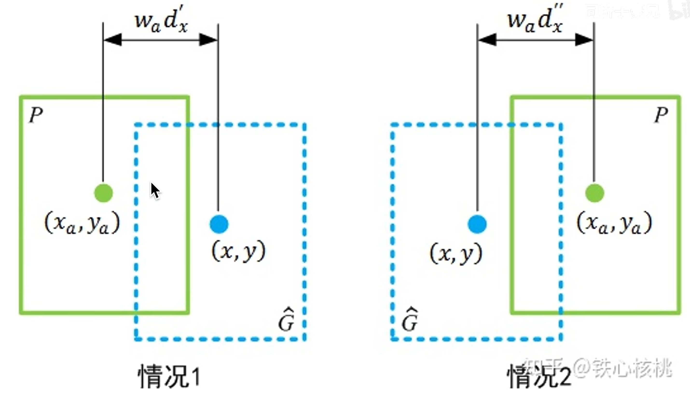

使用 Anchor 的初期问题：如果不加约束，预测框的偏移量 $t_x, t_y$ 可以让框在**整张图上任意移动**（类似 YOLOv1 的"野蛮生长"），导致训练初期极不稳定，模型难以收敛。

### 3.10 Direct Location Prediction — 公式详解

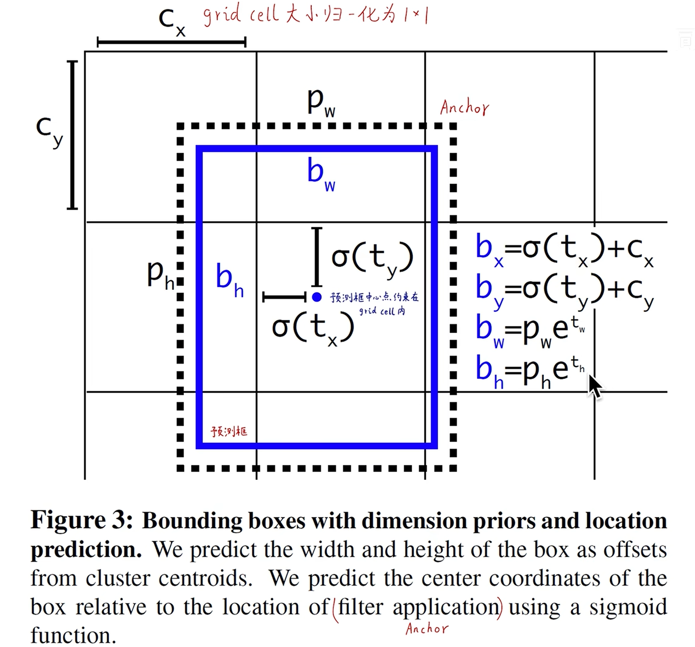

YOLOv2 对预测框坐标采用了一种精心设计的**参数化方案**，核心思想是：**将无约束的坐标回归，分解为"Anchor 先验 + 有界偏移"**。

$$
\boxed{
\begin{aligned}
b_x &= \sigma(t_x) + c_x \\[4pt]
b_y &= \sigma(t_y) + c_y \\[4pt]
b_w &= p_w \cdot e^{\,t_w} \\[4pt]
b_h &= p_h \cdot e^{\,t_h}
\end{aligned}
}
$$

#### 符号说明

| 符号 | 含义 | 来源 |
|------|------|------|
| $t_x, t_y, t_w, t_h$ | 网络预测的**原始输出值**（无界实数） | 网络直接输出 |
| $c_x, c_y$ | 当前 Grid Cell 左上角在特征图上的坐标偏移 | 固定常量 |
| $p_w, p_h$ | Anchor 先验框的宽和高 | K-Means 聚类预设 |
| $b_x, b_y, b_w, b_h$ | 最终预测框的中心坐标、宽、高 | 输出结果 |

---

#### 🔍 为什么 $b_x = \sigma(t_x) + c_x$？（中心坐标）

**问题**：若直接用 $b_x = t_x + c_x$（无约束偏移），$t_x$ 可以是任意实数，预测框中心可能**飞出到整张图的任意位置**——这就是 YOLOv1 的"野蛮生长"问题，训练初期损失巨大、难以收敛。

**方案**：用 Sigmoid 将偏移量锁死在 $(0, 1)$ 区间内：

$$
\sigma(t_x) \in (0, 1)
$$

- $t_x \to +\infty$ 时，$\sigma(t_x) \to 1$，中心贴近 Grid Cell 右边界；
- $t_x \to -\infty$ 时，$\sigma(t_x) \to 0$，中心贴近 Grid Cell 左边界；
- **中心点永远无法越出当前 Grid Cell**。

> 🎯 **设计意图**：每个 Anchor 的"管辖范围"被明确限制在其所属 Grid Cell 内部，不同 Grid Cell 的预测框不会互相侵扰，实现"属地化管理"。

同理，$b_y$ 采用完全对称的处理。

---

#### 🔍 为什么 $b_w = p_w \cdot e^{\,t_w}$？（宽高缩放）⭐

这是整个公式组中**最容易被忽视但最精妙的设计**。分三层理解：

##### 层一：为什么需要 $e^{t_w}$？—— 保证正数

宽和高**必须是正数**。如果直接用 $b_w = p_w + t_w$ 或 $b_w = p_w \cdot t_w$，当 $t_w$ 为负数时，预测的宽/高可能变成零甚至负数——这在物理上毫无意义，也会导致 IoU 计算崩溃。

$$
e^{\,t_w} > 0 \quad \text{恒成立，无论 } t_w \text{ 取何值}
$$

指数函数天然地将任意实数映射到正实数，**优雅地解决了宽度非负约束**。

##### 层二：为什么是乘法而不是加法？—— 对数空间线性化

对 $b_w = p_w \cdot e^{t_w}$ 两边取对数：

$$
\ln(b_w) = \ln(p_w) + t_w
$$

在**对数空间**中，预测变成了简单的**加法**：
- $\ln(p_w)$：Anchor 的先验（已知常数）；
- $t_w$：网络需要学习的对数域偏差。

这意味着网络学习的 $t_w$ 是**相对缩放因子**而非绝对宽度：
- $t_w = 0 \implies b_w = p_w$（预测框宽度 = Anchor 宽度，不做调整）；
- $t_w > 0 \implies b_w > p_w$（预测框比 Anchor 宽）；
- $t_w < 0 \implies b_w < p_w$（预测框比 Anchor 窄）。

> 🎯 **核心洞察**：网络只需要学习"在 Anchor 基础上放大/缩小多少倍"，而非从零预测绝对宽度。这个"相对学习"比绝对回归**稳定得多、快得多**。

##### 层三：为什么 $t_w$ 不加 Sigmoid？—— 宽高不做空间限制

与中心坐标 $(t_x, t_y)$ 不同，**宽高没有 Grid Cell 边界的概念**——一个物体可以横跨多个 Grid Cell，Anchor 的宽高也应该能自由缩放：

- $t_w \to +\infty \implies$ 框可以无限放大（覆盖大目标）；
- $t_w \to -\infty \implies$ 框可以无限缩小（覆盖小目标）。

因此这里**故意不加任何约束**，给模型充分的灵活度。同时 $e^{t_w}$ 保证了无论 $t_w$ 多负，宽度始终为正。

---

#### 📐 四式对比总结

| 公式                        | 约束方式        | 约束范围            | 设计原因                 |
| ------------------------- | ----------- | --------------- | -------------------- |
| $b_x = \sigma(t_x) + c_x$ | **Sigmoid** | $(c_x,\ c_x+1)$ | 中心不越 Grid Cell，属地化管理 |
| $b_y = \sigma(t_y) + c_y$ | **Sigmoid** | $(c_y,\ c_y+1)$ | 同上                   |
| $b_w = p_w \cdot e^{t_w}$ | **指数函数**    | $(0,\ +\infty)$ | 保证正数 + 对数空间线性化 + 无上界 |
| $b_h = p_h \cdot e^{t_h}$ | **指数函数**    | $(0,\ +\infty)$ | 同上                   |

> 🧠 **记忆口诀**：**中心做 Sigmoid 管位置，宽高取指数保正数**；中心约束在格内，宽高自由去缩放。

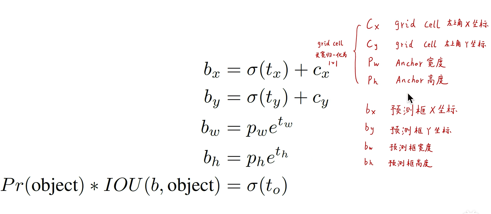

这一设计大幅提升了训练初期的稳定性，是 YOLOv2 相比 v1 收敛更快的关键因素之一。

---

## 4. Confidence Score 解析（置信度）

YOLOv2 的每个预测框输出一个 **Confidence Score（置信度分数）**，其语义定义如下：

$$
\text{Confidence} = \sigma(t_o) \;\xrightarrow{\text{train}}\; \Pr(\text{Object}) \times \text{IoU}_{\text{pred}}^{\text{truth}}
$$

### 4.1 公式拆解

| 符号 | 含义 |
|------|------|
| $t_o$ | 网络输出的原始 logit（未激活的置信度值） |
| $\sigma(t_o)$ | Sigmoid 函数，将置信度压缩到 **(0, 1)** 区间 |
| $\Pr(\text{Object})$ | 当前 Anchor 内**是否存在物体**（训练时：负责预测则该值为 1，否则为 0） |
| $\text{IoU}_{\text{pred}}^{\text{truth}}$ | 预测框与 Ground Truth 的 **交并比（IoU）** |

### 4.2 训练阶段的含义

- 若某个 Anchor 被分配为**正样本**（负责预测某个 Ground Truth）：
  - $\Pr(\text{Object}) = 1$；
  - 网络学习 $\sigma(t_o) \approx \text{IoU}(B_{\text{pred}},\ B_{\text{gt}})$，即**置信度逼近当前预测框与真值框的 IoU**；
  - 预测框越准，置信度越接近 1；框还没学好时 IoU 低，置信度也相应低。

- 若某个 Anchor 为**负样本**（不含物体，或 IoU 低于阈值）：
  - $\Pr(\text{Object}) = 0$；
  - 置信度目标为 0，即 $\sigma(t_o) \to 0$。

> 💡 这种设计的好处：**置信度不仅告诉你"有没有物体"，还告诉你"框画得有多准"**。

### 4.3 推理阶段的含义

推理时，网络直接输出 $\sigma(t_o)$ 作为置信度：

- 置信度 **高**（接近 1） → Anchor 内大概率有物体，且预测框与真实边界吻合度较高；
- 置信度 **低**（接近 0） → Anchor 内没有物体，或框的位置/尺寸不准确。

### 4.4 类别条件概率

每个 Anchor 还输出 **类别条件概率** $\Pr(\text{Class}_i \mid \text{Object})$（也经过 Sigmoid），表示**在确保有物体的前提下**，属于第 $i$ 类的概率。

**最终类别置信度**（class-specific confidence）为两者的乘积：

$$
\Pr(\text{Class}_i) \times \text{IoU} = \underbrace{\Pr(\text{Class}_i \mid \text{Object})}_{\text{条件类别概率}} \;\times\; \underbrace{\Pr(\text{Object}) \times \text{IoU}}_{\text{置信度}}
$$

> 🎯 这也就是 YOLO 系列中常说的 **"class-specific confidence score"**，最终用于 NMS 和检测结果的排序筛选。

### 4.5 损失函数中的位置

在 YOLOv2 的损失函数中，置信度部分的 Loss 为：

$$
\mathcal{L}_{\text{conf}} = \lambda_{\text{obj}} \sum_{i} \mathbf{1}_{i}^{\text{obj}} \big( \sigma(t_o) - \text{IoU} \big)^2 \;+\; \lambda_{\text{noobj}} \sum_{i} \mathbf{1}_{i}^{\text{noobj}} \big( \sigma(t_o) - 0 \big)^2
$$

其中：
- $\mathbf{1}_{i}^{\text{obj}}$：指示第 $i$ 个 Anchor 是否为正样本（负责预测物体）；
- $\mathbf{1}_{i}^{\text{noobj}}$：指示是否为负样本；
- $\lambda_{\text{obj}},\ \lambda_{\text{noobj}}$：正负样本的权重系数（YOLOv2 中 $\lambda_{\text{obj}}=1,\ \lambda_{\text{noobj}}=0.5$，因为负样本数量远多于正样本）。


## 4. YOLOv2 Loss Function（损失函数）

> ⚠️ **说明**：以下损失函数并未出现在 YOLOv2 官方论文中，而是社区从作者 Joseph Redmon 开源的 **Darknet 框架代码**中逆向整理得出。

YOLOv2 的损失函数遍历所有 **13×13×5 = 845** 个预测框，根据每个框与 Ground Truth 的匹配关系，施加不同类型的监督信号。

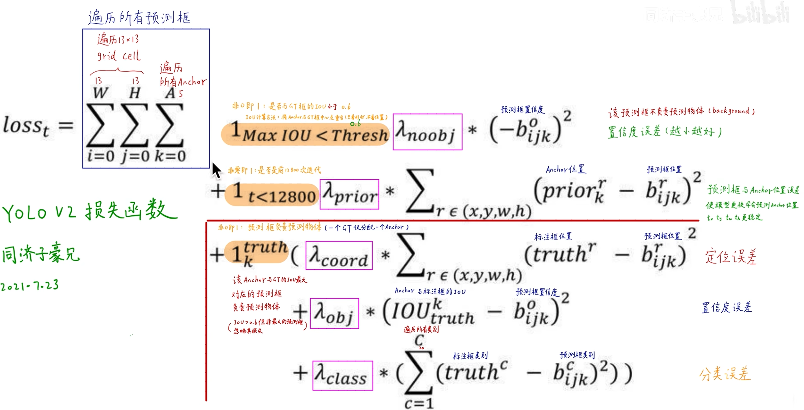

### 4.1 总体公式

$$
\boxed{
\begin{aligned}
\mathcal{L} = \;&\mathbf{1}_{\text{early}} \cdot \mathcal{L}_{\text{anchor}} & &\text{(早期稳定项)} \\[4pt]
+ &\sum_{i} \mathbf{1}_{i}^{\text{best}} \big( \mathcal{L}_{\text{coord}} + \mathcal{L}_{\text{conf\_obj}} + \mathcal{L}_{\text{cls}} \big) & &\text{(正样本损失)} \\[4pt]
+ &\sum_{i} \mathbf{1}_{i}^{\text{noobj}} \; \lambda_{\text{noobj}} \cdot \mathcal{L}_{\text{conf\_noobj}} & &\text{(负样本损失)}
\end{aligned}
}
$$

---

### 4.2 正负样本的判定 —— Anchor Matching 策略

这是理解 YOLOv2 Loss 的**最关键前提**。每个 Anchor 是否参与某项损失的计算，由一套匹配规则决定。

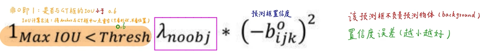

#### 匹配流程

对于某个 Ground Truth 框（以小女孩的标注框为例），遍历当前 Grid Cell 的所有 Anchor：

**Step 1 — 只看形状，不看位置**

将 Anchor 的**中心点平移到 Ground Truth 的中心点**重合，然后计算形状层面（宽、高）的 IoU：

$$
\text{IoU}_{\text{shape}} = \text{IoU}\big(\text{Anchor}(心对齐),\; \text{Ground Truth}\big)
$$

> 💡 中心对齐后，IoU 高低**纯粹取决于长宽比的匹配度**——高瘦的 Anchor 天生和高瘦标注框的 $\text{IoU}_{\text{shape}}$ 更高。

**Step 2 — 划分三组**

| 阈值 | 身份 | 参与哪些损失 |
|------|------|-------------|
| $\text{IoU}_{\text{shape}} = \max$ | **Best Anchor**（负责预测） | $\mathcal{L}_{\text{coord}} + \mathcal{L}_{\text{conf\_obj}} + \mathcal{L}_{\text{cls}}$ |
| $\text{IoU}_{\text{shape}} > 0.6$ 但不是 max | **Ignored Anchor**（忽略） | ❌ 不参与任何损失 |
| $\text{IoU}_{\text{shape}} < 0.6$ | **No-object Anchor**（负样本） | 仅 $\mathcal{L}_{\text{conf\_noobj}}$ |

> 🎯 **设计意图**：Ignore 区的引入非常精妙——IoU 已经超过 0.6 但又不是最佳的 Anchor，说明它"已经挺好了只是有人更优秀"。如果强行让它学置信度为 0，会惩罚一个本来还不错的结果，反而不利于训练。

---

### 4.3 损失项之一：早期稳定项 $\mathcal{L}_{\text{anchor}}$

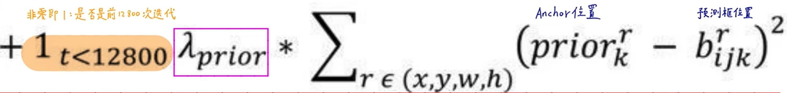

**仅在训练的前 12800 次迭代（约前几个 epoch）中激活**，对**所有 Anchor** 施加，与 Ground Truth 无关：

$$
\mathcal{L}_{\text{anchor}} = \mathbf{1}_{\text{iter} < 12800} \cdot \Big[
(\sigma(t_x) - 0.5)^2 + (\sigma(t_y) - 0.5)^2 + (t_w - 0)^2 + (t_h - 0)^2
\Big]
$$

| 项 | 含义 |
|----|------|
| $\sigma(t_x) \to 0.5$ | 推动预测中心向 Grid Cell 中心靠拢 |
| $\sigma(t_y) \to 0.5$ | 同上 |
| $t_w \to 0$ | $e^{t_w} \to 1$，宽趋近 Anchor 原宽 |
| $t_h \to 0$ | $e^{t_h} \to 1$，高趋近 Anchor 原高 |

> 🧠 **直观理解**：训练初期网络参数是随机的，预测框会满天乱飞。这项损失相当于一根**"缰绳"**，在前期强制每个 Anchor 的预测框缩回其 Grid Cell 中心、尺寸贴近先验框，等模型**站稳脚跟后（12800 轮后）再放手让它自由调整**。

---

### 4.4 损失项之二：正样本三件套（Best Anchor 专属）

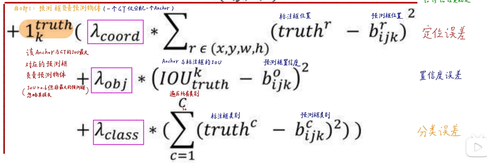

只有 **Best Anchor**（与 Ground Truth 的 $\text{IoU}_{\text{shape}}$ 最高的那个）参与。其他 IoU > 0.6 的 Ignored Anchor **完全不参与**以下任何一项。

#### ❶ 坐标回归损失 $\mathcal{L}_{\text{coord}}$

$$
\mathcal{L}_{\text{coord}} = \lambda_{\text{coord}} \Big[
(t_x - \hat{t}_x)^2 + (t_y - \hat{t}_y)^2 + (t_w - \hat{t}_w)^2 + (t_h - \hat{t}_h)^2
\Big]
$$

- $(t_x, t_y, t_w, t_h)$：网络预测的偏移量
- $(\hat{t}_x, \hat{t}_y, \hat{t}_w, \hat{t}_h)$：Ground Truth 相对于 Anchor 的**真实偏移量**（反算自标注框）
- $\lambda_{\text{coord}}$：坐标损失权重（YOLOv2 中通常取 $5$，强调定位精度）

> 损失在**参数空间**（$t$ 域）而非输出空间（$b$ 域）计算，避免了 Sigmoid/指数变换带来的梯度缩放问题。

#### ❷ 置信度回归损失 $\mathcal{L}_{\text{conf\_obj}}$

$$
\mathcal{L}_{\text{conf\_obj}} = \big( \sigma(t_o) - \text{IoU}(B_{\text{pred}},\ B_{\text{gt}}) \big)^2
$$

- **标签（target）**：当前预测框与 Ground Truth 的 **实际 IoU**——框画得越准，这个标签值越高；
- **预测（prediction）**：$\sigma(t_o)$，即网络输出的置信度。

> 🎯 置信度学的不只是"有物体"（那只需要 0 或 1），而是**当前的预测质量**。框准 → 标签高 → 置信度高；框歪 → 标签低 → 置信度低。

#### ❸ 分类损失 $\mathcal{L}_{\text{cls}}$

$$
\mathcal{L}_{\text{cls}} = \sum_{c=1}^{C} \big( p(c) - \hat{p}(c) \big)^2
$$

- $C$：类别数（PASCAL VOC 为 20）；
- $\hat{p}$：Ground Truth 的 one-hot 类别向量（正确类别为 1，其余为 0）；
- $p$：网络预测的类别概率向量（经 Softmax 归一化）。

> 对 20 维向量逐元素作差、平方、求和，本质是**类别概率的 MSE 回归**（YOLOv1/v2 用 MSE，YOLOv3 后改用交叉熵）。

---

### 4.5 损失项之三：负样本置信度损失 $\mathcal{L}_{\text{conf\_noobj}}$

$$
\mathcal{L}_{\text{conf\_noobj}} = \lambda_{\text{noobj}} \big( \sigma(t_o) - 0 \big)^2
$$

- 仅对 $\text{IoU}_{\text{shape}} < 0.6$ 的 **No-object Anchor** 施加；
- $\lambda_{\text{noobj}} = 0.5$：负样本数量远超正样本，若不加权会淹没正样本信号；
- 目标：**压制低质量框的置信度趋于 0**。

---

### 4.6 损失项汇总表

| 损失项 | 符号 | 作用对象 | 含义 |
|--------|------|----------|------|
| 早期锚框稳定 | $\mathbf{1}_{\text{early}} \cdot \mathcal{L}_{\text{anchor}}$ | **所有 Anchor**（前 12800 iter） | 让预测框缩回中心 + 贴近先验形状 |
| 坐标回归 | $\mathbf{1}^{\text{best}} \cdot \mathcal{L}_{\text{coord}}$ | **Best Anchor** 仅一个 | 让框的四维坐标逼近真值 |
| 置信度（正） | $\mathbf{1}^{\text{best}} \cdot \mathcal{L}_{\text{conf\_obj}}$ | **Best Anchor** 仅一个 | 置信度拟合当前预测框的 IoU 质量 |
| 分类 | $\mathbf{1}^{\text{best}} \cdot \mathcal{L}_{\text{cls}}$ | **Best Anchor** 仅一个 | 类别概率逼近 one-hot 真值 |
| 置信度（负） | $\mathbf{1}^{\text{noobj}} \cdot \mathcal{L}_{\text{conf\_noobj}}$ | $\text{IoU}_{\text{shape}} < 0.6$ 的所有 Anchor | 低质量框置信度 → 0 |
| *(忽略)* | — | $0.6 < \text{IoU}_{\text{shape}} < \max$ 的 Anchor | 不参与任何损失，自然过渡 |

---

### 4.7 与 YOLOv1 Loss 的关键区别

| 维度 | YOLOv1 | YOLOv2 |
|------|--------|--------|
| 坐标回归方式 | 直接回归 $(x, y, w, h)$ | 回归 Anchor 的偏移量 $(t_x, t_y, t_w, t_h)$ |
| 置信度标签 | $\Pr(\text{Object}) \times \text{IoU}$（固定） | $\text{IoU}(B_{\text{pred}},\ B_{\text{gt}})$（随预测动态变化） |
| 负样本处理 | $\lambda_{\text{noobj}}$ 对所有非责任框 | 引入 Ignore 区（IoU > 0.6），不惩罚 "还不错" 的框 |
| 早期稳定 | 无 | 前 12800 iter 的 $\mathcal{L}_{\text{anchor}}$ 强制稳定化 |
| 损失空间 | 输出空间 | 参数空间（$t$ 域），与 Sigmoid/Exp 解耦 |

> 📌 YOLOv2 Loss 的三大核心设计哲学：**Anchor 先验降低学习难度**、**Ignore 区避免错误惩罚**、**早期稳定项防止训练发散**。

## 5. Fine-Grained Features（细粒度特征融合）

> 🎯 **解决的问题**：深层特征图虽然有丰富的语义信息，但**空间分辨率低**，对小物体的定位能力不足。YOLOv2 通过 Passthrough Layer 将浅层高分辨率特征注入到最终检测层，提升小目标检测性能。

### 5.1 核心动机 —— 小目标的困境

YOLOv2 的骨干网络 Darknet-19 经过 5 次 Max Pooling（每次下采样 2×），输入 $416 \times 416$ 最终输出 $13 \times 13$ 的特征图用于检测。这一过程中：

- **深层特征**（$13 \times 13$）：语义强、感受野大 → 擅长判断"是什么"；
- **浅层特征**（$26 \times 26$，靠近输入）：空间信息丰富 → 擅长判断"在哪里"。

> 小目标（如远处的行人、桌上的杯子）在 $13 \times 13$ 的特征图上可能只占 **1~2 个 Grid Cell**，仅靠深层特征难以精确定位。需要引入浅层的细粒度空间信息来辅助。

---

### 5.2 Passthrough Layer（穿越层）—— 核心操作

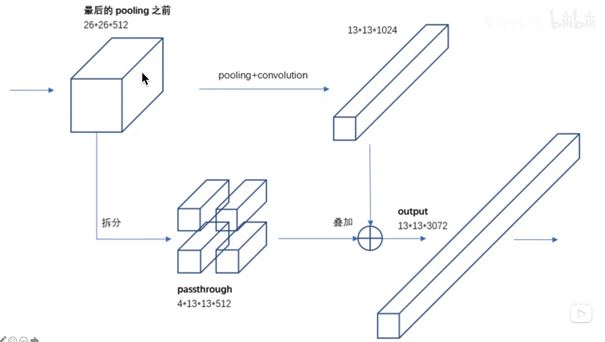

YOLOv2 在网络倒数第二层（Pooling 之前，尺寸 $26 \times 26 \times 512$）引出一条分支，通过 **Passthrough Layer** 将其融入最终检测层。

#### 操作流程

```
26×26×512 ──→ [1×1 Conv, 64] ──→ 26×26×64 ──→ [Passthrough] ──→ 13×13×256
                                                                       ↓
26×26×512 ──→ [后续 Conv + Pool] ──→ 13×13×1024 ──→ [Concat] ──→ 13×13×1280 ──→ 检测头
```

#### Passthrough 的空间重排机制

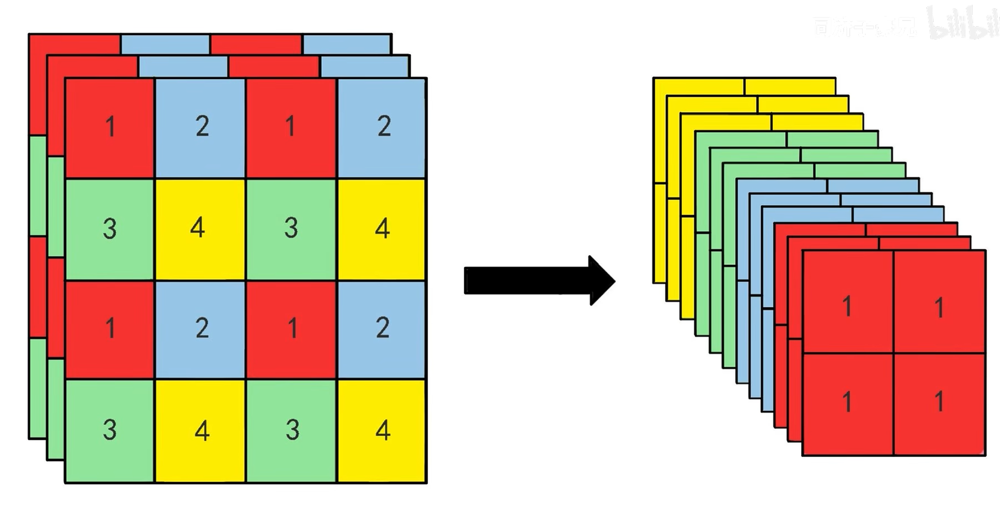

将高分辨率特征图上的**相邻空间像素，沿通道维度堆叠**：

| 维度 | 变换前 | 变换后 |
|------|--------|--------|
| 空间 | $26 \times 26$ | $13 \times 13$（缩为一半） |
| 通道 | $C$ | $4C$（扩为四倍） |

具体做法：将 $26 \times 26 \times C$ 的特征图中每个 $2 \times 2$ 的局部区域拆分：

$$
(1,1),\ (1,2),\ (2,1),\ (2,2)
$$

这 4 个位置的像素按颜色（红、蓝、绿、紫）分别提取，堆叠到通道维度上：

- 空间分辨率减半：$26/2 = 13$
- 通道数翻四倍：$C \times 4$

> 🔗 这个操作与 **YOLOv5 中的 Focus 模块** 完全等价，也和 TensorFlow 的 `space_to_depth`、PyTorch 的 `PixelUnshuffle` 是同一个操作。

---

### 5.3 代码实现中的细节（论文 vs 源码）

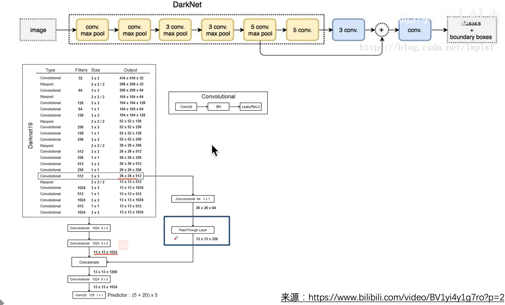

原始论文中并未详细描述以下细节，但从 **Darknet 源码** 中可以确认实际实现：

| 步骤 | 操作 | 维度变化 |
|------|------|----------|
| ① | 取 Pooling 前的特征 | $26 \times 26 \times 512$ |
| ② | **1×1 卷积降维**（64 个卷积核） | $26 \times 26 \times \mathbf{64}$ |
| ③ | Passthrough 空间重排 | $13 \times 13 \times 256$（$64 \times 4$） |
| ④ | 与主路特征 Concatenate | $13 \times 13 \times (1024 + 256) = \mathbf{13 \times 13 \times 1280}$ |
| ⑤ | 送入检测头 | 最终输出 $13 \times 13 \times 125$ |

> ⚠️ **论文与代码不一致**：论文未提及 ①→② 的 **64 个 1×1 卷积降维**，但在源码中这是实际存在的。如果不降维，Passthrough 后通道数将是 $512 \times 4 = 2048$，与主路 $1024$ 拼接后达 $3072$，计算量过大且信息冗余。**1×1 卷积起到通道压缩 + 信息提炼的双重作用**。

---

### 5.4 为什么不直接用大尺寸 Feature Map 做检测？

一个自然的疑问：既然小目标需要高分辨率，为什么不直接在 $26 \times 26$ 上做检测？

| 方案 | 优点 | 缺点 |
|------|------|------|
| 纯 $13 \times 13$ 检测 | 速度快，语义强 | 小目标定位差 |
| 纯 $26 \times 26$ 检测 | 定位好 | 速度慢 $4\times$，大目标感受野不足 |
| **Passthrough 融合** ✅ | 兼顾语义 + 空间，速度代价小 | 通道数略增 |

> YOLOv2 的 Passthrough 是后续 **FPN（Feature Pyramid Network）** 和 **YOLOv3 多尺度预测** 的思想雏形——用极小的计算代价实现多层特征融合。

---

### 5.5 与相关概念的对比

| 概念 | 核心思路 | 关系 |
|------|----------|------|
| **ResNet Skip Connection** | 逐元素相加（$A + B$），恒等映射 | YOLOv2 受其启发但用 **Concat** 而非 Add |
| **FPN** | 自顶向下路径 + 横向连接，多尺度独立预测 | Passthrough 是其**早期简化版**（仅两层融合） |
| **YOLOv5 Focus** | 空间到深度的重排 | 与 Passthrough **操作等价** |
| **DenseNet** | 密集 Concat 连接 | 思想同源：Concat 保留更多原始信息 |

> 💡 YOLOv2 的 Passthrough + Concat 与 ResNet 的 Add 有本质区别：**Concat 保留了浅层特征的独立性**（后续卷积可以自行选择关注哪些通道），而 Add 会强制混合。对于目标检测这种同时需要"定位"和"分类"的任务，Concat 往往更优。

## 6. Multi-Scale Training（多尺度训练）

> 🎯 **核心思想**：训练时每隔若干轮就换一种输入分辨率，强迫同一个模型学会处理任意尺度的图像。推理时用户可以根据需求选择"高分辨率高精度"或"低分辨率高速度"。

### 6.1 为什么 YOLOv2 能输入不同尺寸的图片？

YOLOv1 使用**全连接层**作为最终输出，要求输入尺寸固定（$448 \times 448$），否则全连接层的权重矩阵维度对不上。

YOLOv2 的骨干网络 **Darknet-19** 中，用 **Global Average Pooling（全局平均池化）** 替代了全连接层：

$$
\text{GAP:} \quad \text{对每个通道的整张 Feature Map 取平均} \ \longrightarrow\ \text{1 个标量}
$$

- **全连接层**：$W \in \mathbb{R}^{D_{\text{in}} \times D_{\text{out}}}$，$D_{\text{in}}$ 必须固定 → 输入尺寸必须固定；
- **Global Average Pooling**：无论输入多大，每个通道始终压缩为 1 个数 → **输入尺寸可以任意变化**。

> 💡 这是 YOLOv2 能支持多尺度训练和多尺度推理的根本原因。分类阶段用 GAP 取代 FC，检测阶段则完全由卷积 + Concat 构成（全是尺寸无关操作）。

---

### 6.2 训练策略：每 10 个 batch 换一次分辨率

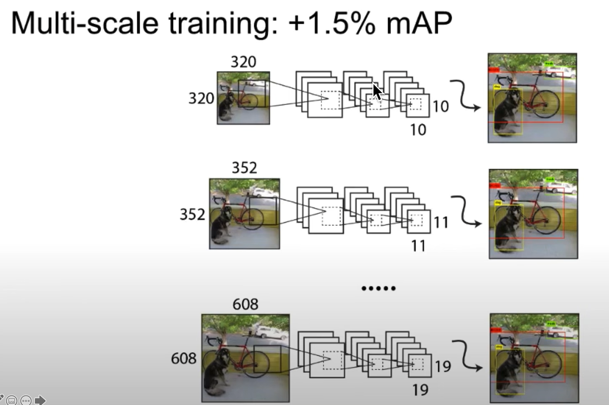

**操作方式**：同一个模型、同一组权重，训练中每隔 **10 个 batch** 随机从以下尺寸池中选取一个新的输入分辨率：

$$
\{320,\ 352,\ 384,\ 416,\ 448,\ 480,\ 512,\ 544,\ 576,\ 608\} \quad (\text{均为 32 的倍数})
$$

> ℹ️ 选用 32 的倍数是因为 Darknet-19 有 5 层 Max Pooling（$2^5 = 32$），保证 Feature Map 尺寸始终为整数。

**关键点**：
- 模型**结构和权重完全不变**，仅输入图像被 resize 到不同尺寸；
- 模型被迫学会**尺度不变的特征表达**——同一物体在 320×320 和 608×608 中都应该被准确检测；
- 相当于一种**免费的数据增强**，不增加标注成本。

> 📊 **效果**：多尺度训练带来约 **1.5% mAP** 的提升。

---

### 6.3 速度与精度的权衡（Speed-Accuracy Tradeoff）

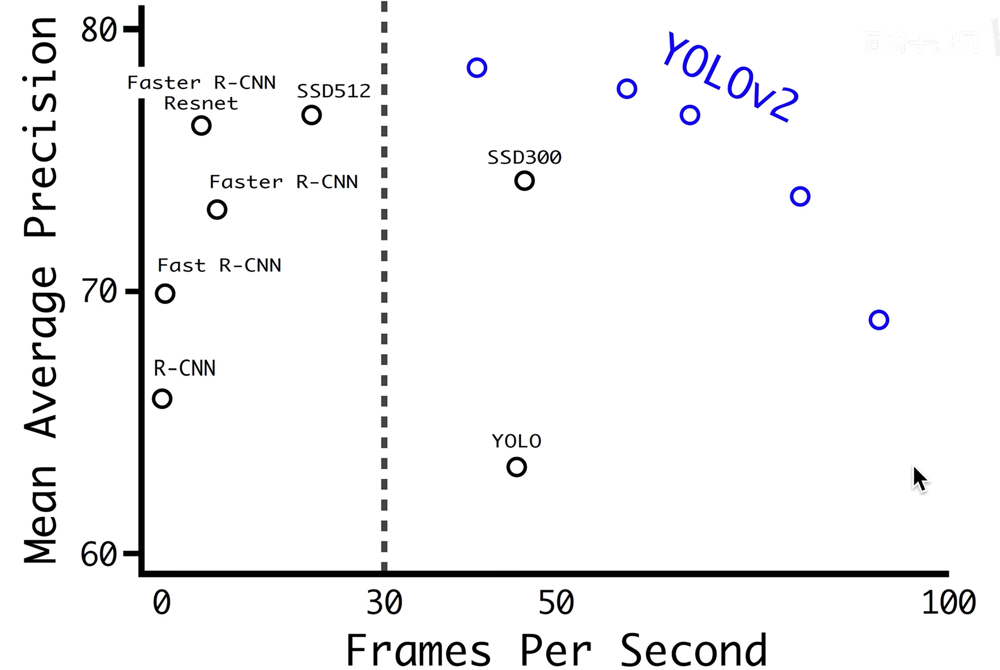

多尺度训练的**副作用**成为一个实用功能：**同一份训练好的权重，推理时可以自由选择输入分辨率**。

| 输入分辨率               | 推理速度  | 检测精度 | 适用场景        |
| ------------------- | ----- | ---- | ----------- |
| $320 \times 320$    | ⚡ 极快  | 较低   | 实时视频流、嵌入式设备 |
| $416 \times 416$    | 较快    | 中等   | 标准实时检测      |
| $544 \times 544$ 以上 | 🐢 较慢 | 🔍 高 | 离线高精度分析     |

> 🎯 业界标准：**FPS > 30** 即可视为**实时检测系统**。从图中可看出，在同等速度下 YOLOv2 精度最高，同等精度下 YOLOv2 速度最快——**Pareto 前沿的全面领先**。

---

### 6.4 消融实验：逐模块改进轨迹

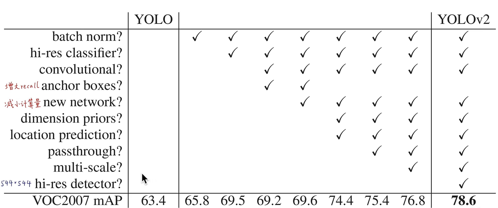

下面这张图追踪了从 YOLOv1 基础模型出发，**逐个叠加改进模块** 在 PASCAL VOC 验证集上的 mAP 变化：

| 步骤           | 添加的模块                      | mAP        | 备注                 |
| ------------ | -------------------------- | ---------- | ------------------ |
| baseline     | YOLOv1                     | 63.4       | 起点                 |
| +BN          | Batch Normalization        | **+2.4** ↑ | 单模块涨幅最大            |
| +Hi-Res      | High Resolution Classifier | **+3.5** ↑ | 适应 448×448         |
| +Anchor      | Anchor Boxes               | **−0.3** ↓ | 精度微降，但 Recall 大幅提升 |
| +New Net     | Darknet-19                 | +0.4 ↑     | 涨幅不大，但**计算量大减**    |
| +Dimension   | K-Means 聚类的 Anchor         | **+4.8** ↑ | 聚类 Anchor 远优于手动设计  |
| +Location    | Direct Location Prediction | 继续提升       | Sigmoid 约束稳定训练     |
| +Passthrough | Fine-Grained Features      | 继续提升       | 融合浅层空间信息           |
| +Multi-Scale | Multi-Scale Training       | 继续提升       | 尺度鲁棒性              |
| +Hi-Res Det  | 高分辨率检测器                    | 继续提升       | —                  |
| **最终**       | **YOLOv2 544**             | **78.6**   | **超越同期所有模型**       |

#### 🔍 关键洞察：为什么 +Anchor 反而降了 mAP？

加了 Anchor 后 mAP 降低了 0.3，但这**不是坏事**：

- YOLOv1 一张图最多产生 $7 \times 7 \times 2 = 98$ 个预测框；
- YOLOv2 一张图产生 $13 \times 13 \times 5 = 845$ 个预测框（**8.6 倍**）。

预测框数量暴增 → **Recall（召回率）大幅提升** → 更多目标被找到 → 但同时更多误检拉低了 **Precision（精确率）**。而 Precision 的下降可以通过 NMS 等后处理弥补，Recall 的提升却是实打实的收益。

> 🧠 **核心教训**：mAP 不是唯一指标。Anchor 牺牲了微小的 mAP 换来了巨大的 Recall 提升和训练稳定性，是一项**战略性正确**的设计决策。

---

### 6.5 整节总结：多尺度训练的三重价值

| 价值 | 说明 |
|------|------|
| 🎓 **训练层面** | 免费的数据增强，模型学到尺度不变特征（+1.5% mAP） |
| ⚖️ **部署层面** | 同一权重实现速度-精度自由切换，一套模型覆盖多场景 |
| 🏆 **性能层面** | YOLOv2 544×544 以 78.6 mAP + 40 FPS 碾压同期 Faster R-CNN、SSD 等模型 |

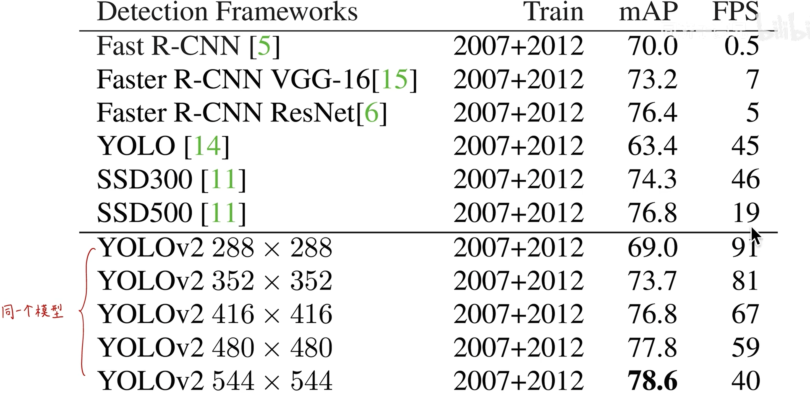

> 💡 同一个模型、同一组权重，仅改变输入分辨率就能产生截然不同的精度-速度表现——这是 YOLOv2 "实用主义"设计哲学的缩影。

# Faster —— Darknet-19 骨干网络

> 📌 YOLOv2 论文标题中的 **"Faster"** 指向的是全新的骨干网络 **Darknet-19**——在精度不降的前提下大幅提升推理速度。

---

## 7. 为什么需要换骨干网络？

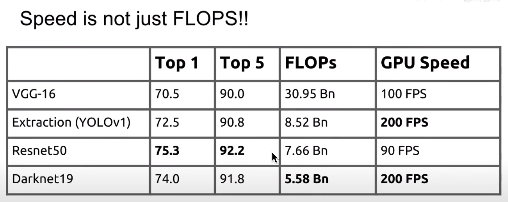

YOLOv1 的骨干基于 GoogLeNet 的自定义版本，虽然推理速度快，但精度有限。YOLOv2 的作者考察了当时主流的几种骨干方案：

| 骨干网络 | 精度 (Top-1) | 计算量 | 推理速度 | 问题 |
|----------|-------------|--------|----------|------|
| **VGG-16** | 较高 | ~30.6 BFLOPs | 🐢 慢 | 模型臃肿，大量 3×3 卷积堆积 |
| **YOLOv1 骨干** | 偏低 | 较小 | ⚡ 快 | 精度不理想 |
| **ResNet-50** | 🔍 高 | ~7.6 BFLOPs | 中等 | 层数深+跨层连接多，FPS 仍不够高 |
| **Darknet-19** ✅ | 🔍 接近 ResNet | ~5.6 BFLOPs | ⚡ 快 | 精度高 + 计算量小 + 结构简洁 |

> 🎯 **设计哲学**：Darknet-19 不追求"最深"或"最宽"，而是追求**精度与速度的 Pareto 最优**——用最经济的计算代价获得最好的特征表达。

---

## 8. Darknet-19 架构详解

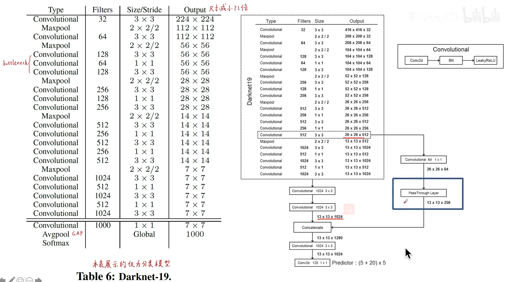

Darknet-19 有 **19 个卷积层 + 5 个 Max Pooling 层**，分为"分类版"和"检测版"两种配置：

### 8.1 分类版 Darknet-19（左图）

用于 ImageNet 预训练，最终输出 1000 类概率：

| 组件 | 规格 | 说明 |
|------|------|------|
| 卷积层 | **19 层**（含大量 1×1） | 1×1 卷积穿插降维/升维，极大压缩计算量 |
| Max Pooling | **5 层**（stride=2） | $224 \to 112 \to 56 \to 28 \to 14 \to 7$，缩小 **32 倍** |
| 分类头 | **Global Average Pooling** | 对 $7 \times 7 \times 1000$ 每通道求平均 → 1000 维向量 |
| 输出 | **Softmax** | 1000 类 ImageNet 概率 |

> 💡 **1×1 卷积的核心作用**：先用 1×1 卷积将通道数压缩（如 $256 \to 128$），再紧跟 3×3 卷积提取特征，最后用 1×1 卷积升维。这种 **Bottleneck 结构**计算量远小于全程 3×3 卷积。

### 8.2 检测版 Darknet-19（右图）

在分类版基础上做三处改动，适配目标检测任务：

| 改动   | 分类版                      | 检测版                             |
| ---- | ------------------------ | ------------------------------- |
| 最后几层 | 1×1 Conv → GAP → Softmax | **去掉 GAP**，保留卷积层                |
| 新增层  | —                        | 追加 **3 层 3×3 卷积**（共 1024 通道）    |
| 特征融合 | —                        | 插入 **Passthrough Layer**（详见 §5） |
| 检测头  | —                        | **1×1 卷积**直接输出 **13×13×125**    |

**改动原因**：

- **去掉 GAP**：检测需要保留空间信息，GAP 会把空间维度压成 1×1，丢失目标位置；
- **追加 3 层 3×3 卷积**：给检测头足够的容量来学习检测相关的特征表达；
- **Passthrough Layer**：融合浅层细粒度特征（详见 §5）；
- **1×1 检测头**：全卷积输出，适配多尺度输入。

---

## 9. 输入 → 输出全流程

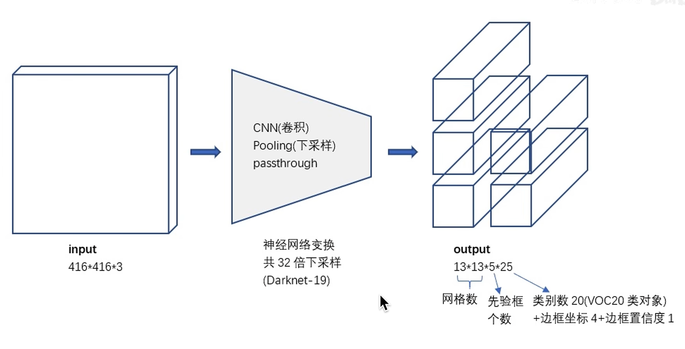

$$
\boxed{416 \times 416 \times 3 \;\xrightarrow{\; \text{Darknet-19} \;+\; \text{Passthrough} \;} \; 13 \times 13 \times 125}
$$

| 阶段             | 操作                       | 维度变化                          |
| -------------- | ------------------------ | ----------------------------- |
| 输入             | RGB 图像                   | $416 \times 416 \times 3$     |
| 5× Max Pooling | 每次 2× 下采样                | $416 \to 13$（$2^5 = 32$）      |
| Passthrough    | 拼接 $26\times26$ 浅层特征     | 通道数 $1024 + 256 = 1280$       |
| 1×1 检测头        | 通道压缩至 $k \times (5 + C)$ | $1280 \to 125$                |
| **输出**         | 每个 Grid Cell 的检测张量       | **$13 \times 13 \times 125$** |

---

## 10. 性能基准

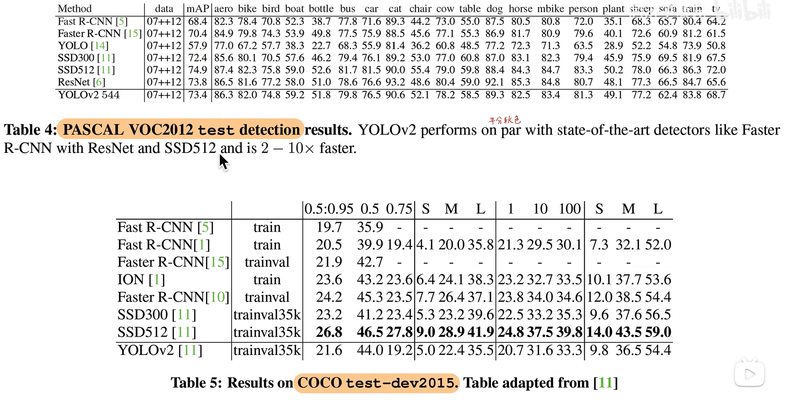

| 数据集        | 训练数据                                | 测试数据    | mAP       | FPS         |
| ---------- | ----------------------------------- | ------- | --------- | ----------- |
| PASCAL VOC | 07 trainval + 07 test + 12 trainval | 12 test | 78.6      | 40          |
| COCO       | —                                   | —       | 与 SOTA 持平 | **远超** SOTA |

> ℹ️ **07++12 含义**：训练时合并使用 VOC 2007 的 trainval + test 和 VOC 2012 的 trainval，在 VOC 2012 test 上评估。这是 PASCAL VOC 的标准评测协议——训练数据越多，泛化能力越强。

**关键结论**：
- YOLOv2 在精度上与 Faster R-CNN、SSD 等同期 SOTA 模型**平分秋色**；
- 在推理速度上**一个数量级的领先**（40 FPS vs Faster R-CNN 的 7 FPS）；
- 更换 Darknet-19 骨干后，**计算量大幅下降**但精度不降反升。

---

# Stronger —— YOLO9000（9000 类检测）

> 📌 论文标题中的 **"Stronger"** 对应 **YOLO9000**：一个能检测 **9000+ 个类别**的模型。核心思路是将目标检测数据集（有 BBox 标注）和图像分类数据集（仅有类别标签）**联合训练**，让模型同时学会"定位"和"细粒度识别"。

> ⚠️ **说明**：YOLO9000 是论文中一个更多带有**探索性质**的想法，核心贡献不如前面的改进模块那样落地广泛，但其**WordTree 分层分类**和**联合训练策略**至今仍具启发性。

---

## 11. 为什么需要 YOLO9000？

### 11.1 数据集的困境

| 数据集 | 类别数 | BBox 标注 | 问题 |
|--------|--------|-----------|------|
| PASCAL VOC | 20 | ✅ 有 | 类别太少，模型能检测的种类有限 |
| COCO | 80 | ✅ 有 | 类别仍然有限 |
| ImageNet 1K | 1000 | ❌ 无 | 类别丰富但**没有定位标注** |
| ImageNet 22K | 22000 | ❌ 无 | 最多类别，但也无定位标注 |

> 🎯 **核心矛盾**：想要检测更多类别 → 需要更多 BBox 标签 → 标注成本极高。能否用"免费"的分类数据集来扩展检测类别？

### 11.2 YOLO9000 的思路

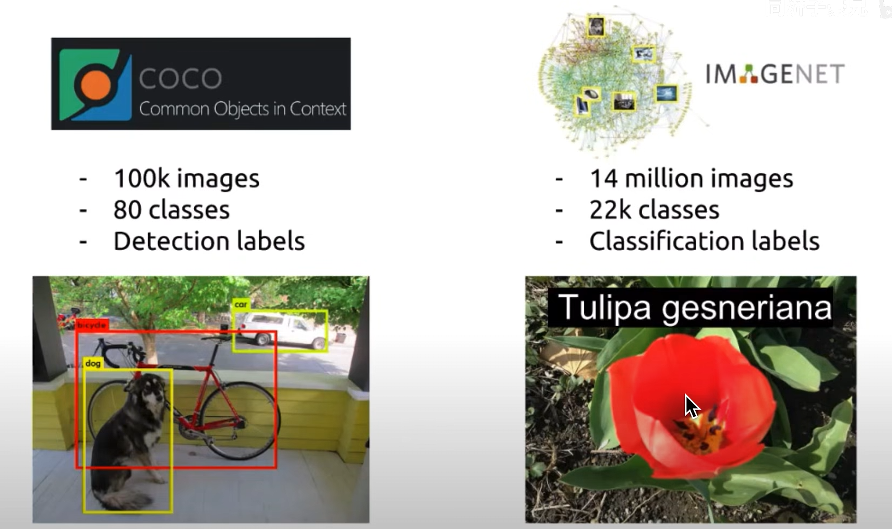

将 **COCO 检测数据集**（80 类，有 BBox）与 **ImageNet 1K 分类数据集**（1000 类，仅标签）合并，构建一个覆盖 **9418 个类别**的联合数据集，训练一个**同时具备定位与细粒度识别能力**的模型。

> 联合后约 9000 类 → 故称 **YOLO9000**。

---

## 12. 第一个难题：分类结构的冲突

### 12.1 传统 Softmax 的局限性

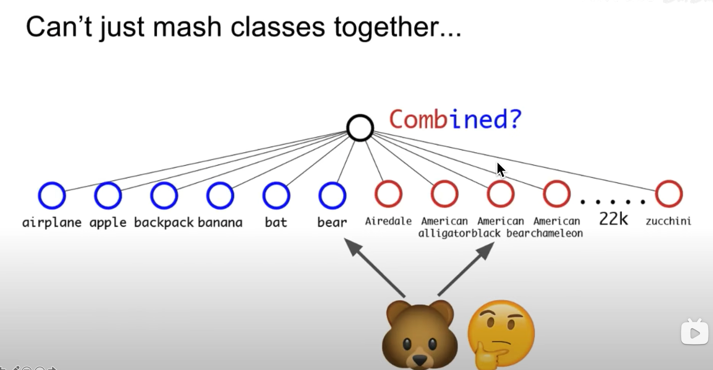

传统图像分类使用 **Softmax** 输出各类别概率：

$$
P(c) = \frac{e^{z_c}}{\sum_{k=1}^{K} e^{z_k}}, \quad \sum_{c=1}^{K} P(c) = 1
$$

**问题**：Softmax 假设所有类别**互斥**（概率和为 1）。但对 ImageNet 来说这并不合理：

- "狗"和"泰迪犬"不是互斥关系——泰迪犬**就是**狗；
- "熊"和"美洲黑熊"也不是互斥——美洲黑熊**就是**熊；
- 强制互斥会破坏类别间的**上下位语义关系**（hypernym / hyponym）。

### 12.2 ImageNet 的混乱结构

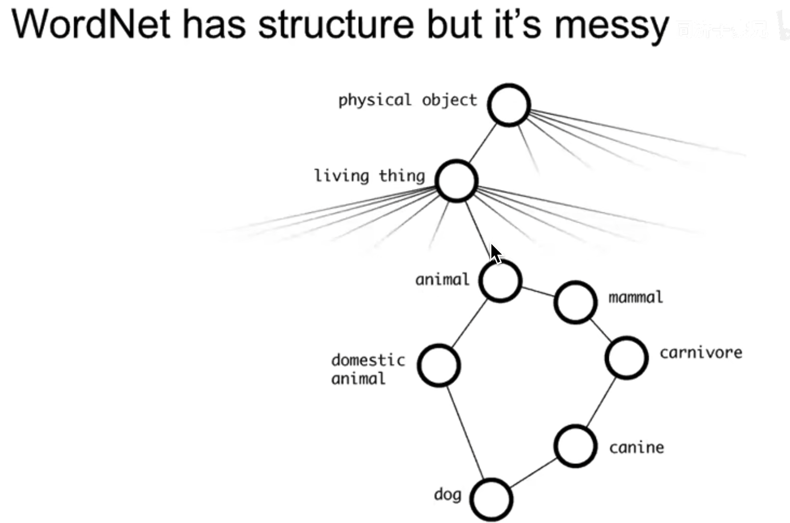

ImageNet 基于 WordNet 构建，类别间的关系是一个**有向图（Directed Graph）**而非扁平列表。图中存在大量交叉引用和多对多关系，直接做 Softmax 分类会把"父子关系"硬扭成"互斥关系"。

---

## 13. 解决方案：WordTree（词树）

### 13.1 从有向图到树结构

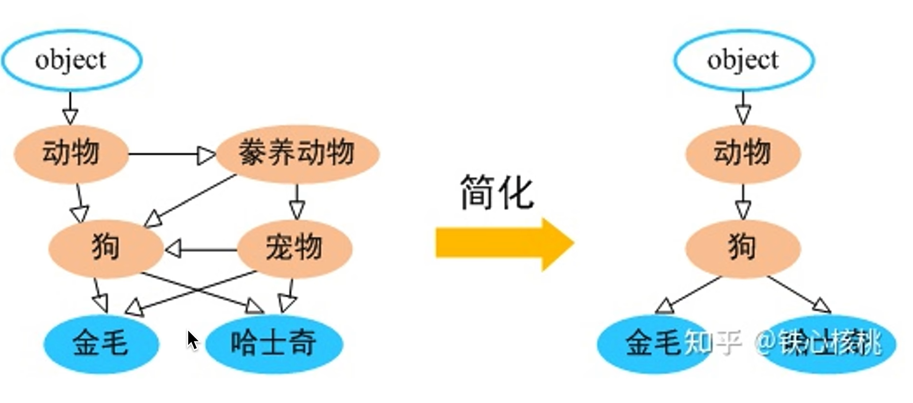

将 WordNet 的有向图**简化为一棵有根树**（Rooted Tree），只保留"IS-A"（属于）关系的主干路径：

- 每个节点只有一个父节点（单继承）；
- 根节点统一为 `physical object`（物理实体）；
- 叶子节点对应具体的可检测类别。

> 树结构天然支持**层次化语义**：父节点 → 子节点的关系是"包含"而非"互斥"。

### 13.2 分层 Softmax（Hierarchical Softmax）

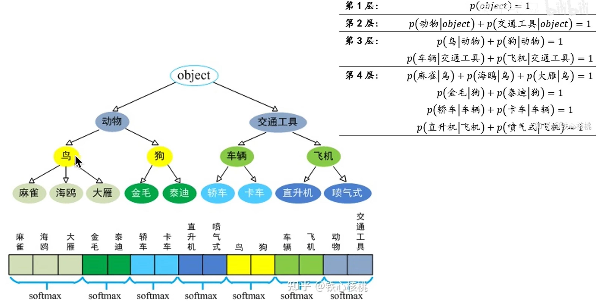

**核心操作**：不对所有类别做 Softmax，而是**对同一个父节点下的所有子节点（兄弟节点）分别做 Softmax**。

以动物分支为例：

```
                    physical object
                           │
                        动物  ←── 所有动物的祖先节点
                        /   \
                      鸟     狗  ←── 对"鸟"和"狗"做 Softmax（同级兄弟）
                     /|\     |
                   ... ...   ...
```

- 在"动物"节点下，对 {鸟, 狗, 猫, ...} 各同级组分别 Softmax；
- 在"狗"节点下，对 {哈士奇, 金毛, 泰迪, ...} 各同级组分别 Softmax；
- 每组内部互斥（一只狗不可能是鸟），但**跨组不互斥**。

### 13.3 条件概率链

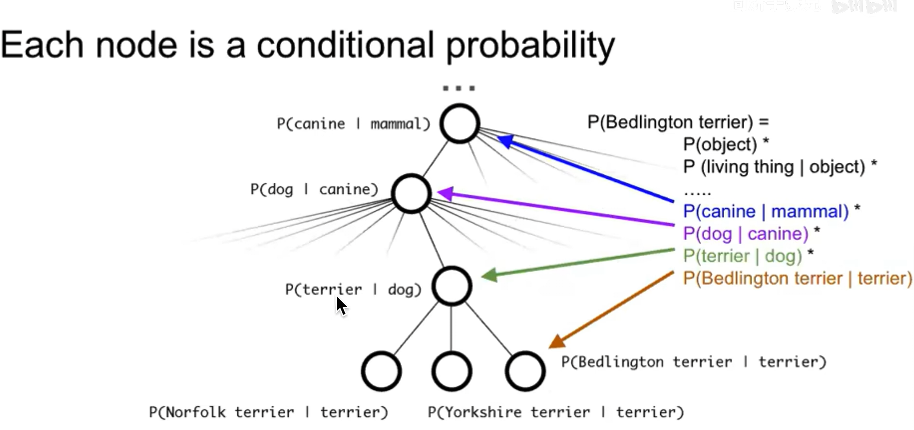

预测一个类别标签时，沿树从根到叶，**逐级计算条件概率并连乘**：

$$
\Pr(\text{Norfolk terrier}) = \Pr(\text{Norfolk terrier} \mid \text{terrier}) \;\times\; \Pr(\text{terrier} \mid \text{狗}) \;\times\; \Pr(\text{狗} \mid \text{犬科}) \;\times\; \Pr(\text{犬科} \mid \text{哺乳动物}) \;\times\; \cdots
$$

> 🧠 这本质上就是**决策树中的路径概率**——每一级只在自己兄弟中竞争，不需要和"鸟类"或"汽车"抢概率。

### 13.4 扁平 vs 分层对比

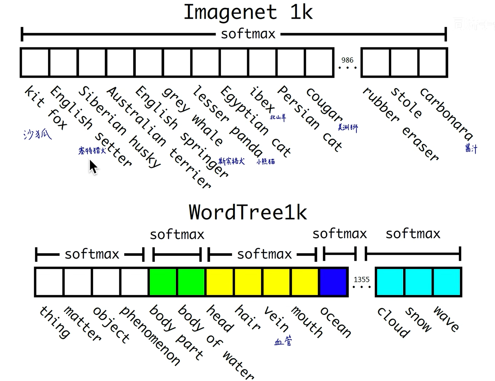

| 维度 | 扁平 Softmax | WordTree |
|------|-------------|----------|
| 类别关系 | 全部互斥 | 兄弟互斥，父子包含 |
| 语义合理性 | ❌ "狗"和"泰迪"互斥 → 不合理 | ✅ 分层包含关系 → 合理 |
| 计算复杂度 | $O(K)$，$K$=总类别数 | $O(\text{树深度} \times \text{平均分支数})$，更高效 |
| 泛化能力 | 见过狗就能检测狗，但不能识别未见的子类型 | **共享祖先特征**，对未见的细粒度类别也有一定泛化能力 |

### 13.5 构建 WordTree1k

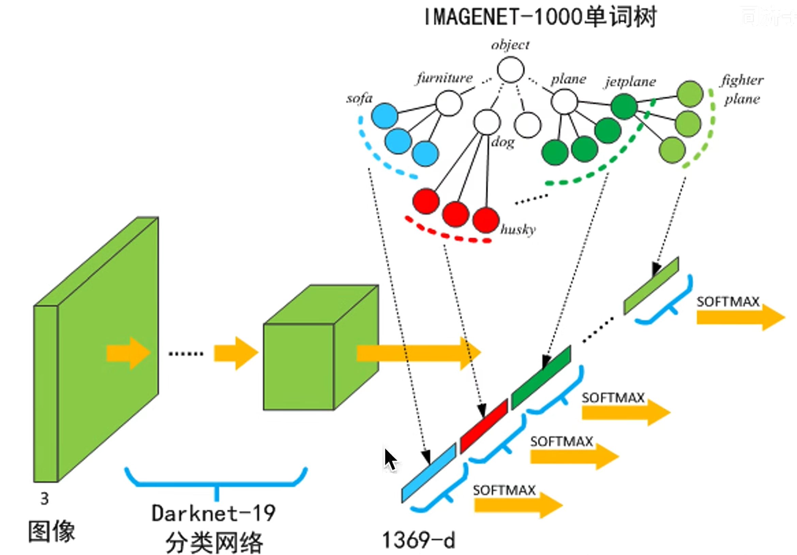

将 ImageNet 1K 类别按 WordNet 路径映射到 WordTree 上（黄色=人体组织/器官，蓝色=环境等），用 **Darknet-19 分类网络** 在 WordTree 上进行分层 Softmax 训练。

- 每个同父组内部使用 Softmax 分类；
- 不同组之间概率独立；
- 同类别的细粒度子类型自然聚合在同一子树下。

---

## 14. 第二个难题：联合训练（Joint Training）

### 14.1 两类数据如何一起训练？

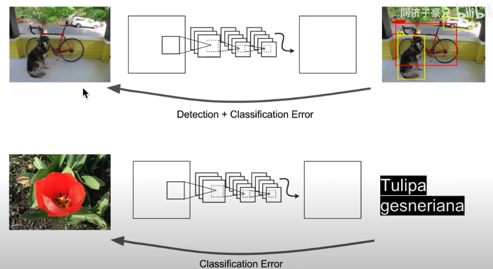

训练 batch 中混合了两种数据源：

| 数据来源 | 有什么标签 | 反向传播哪部分 Loss |
|----------|-----------|---------------------|
| **COCO（检测数据）** | BBox + 类别 | 完整的 YOLOv2 Loss（坐标 + 置信度 + 分类） |
| **ImageNet（分类数据）** | 仅类别 | **仅反向传播分类 Loss**（定位部分不参与） |

### 14.2 实现细节

对于一张 ImageNet 分类图片：

1. 网络仍会输出 $13 \times 13 \times 125$ 的完整检测张量；
2. 但**只有分类 Loss 被激活**——取整张图置信度最高的预测框，用其类别预测与 WordTree 标签计算分层 Softmax Loss；
3. 坐标回归 Loss 和置信度 Loss 对这类样本**不参与梯度反传**。

> 🎯 分类数据教会模型**"这是什么"**（细粒度类别知识），检测数据教会模型**"在哪是什么"**（定位 + 分类）。

### 14.3 COCO + ImageNet → 联合 WordTree

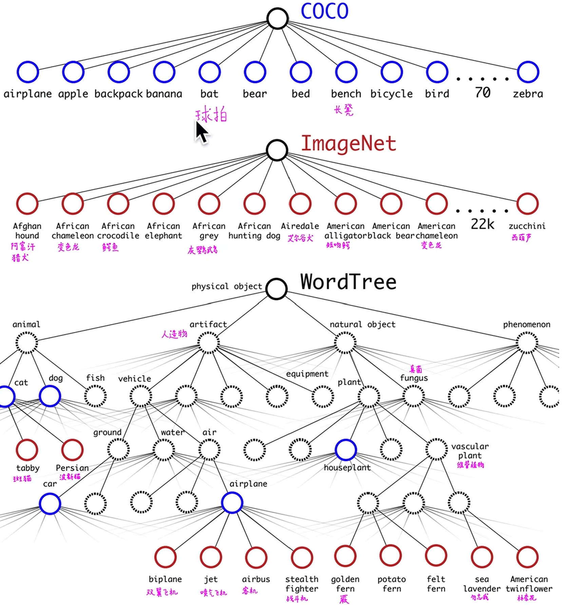

将 COCO 的 80 个检测类别和 ImageNet 的 1000 个分类类别合并到同一棵 WordTree 中，共 9418 个节点。合并后的树既包含了粗粒度的检测类别（如"狗"），又包含细粒度的分类类别（如"Norfolk terrier"）。

> 💡 即使 ImageNet 数据没有 BBox，模型也能通过共享的卷积特征学到这些细粒度类别的视觉特征，从而在检测任务中识别出从未见过 BBox 标注的稀有类别。

---

## 15. YOLO9000 小结

| 维度 | 说明 |
|------|------|
| **动机** | 突破检测数据集类别数的天花板（20/80 → 9000+） |
| **核心创新** | WordTree 分层 Softmax + 检测-分类联合训练 |
| **最大贡献** | 证明了**分类数据可以辅助检测任务**，无需 BBox 标注也能扩展检测类别 |
| **局限性** | 分类数据无 BBox → 定位不够精确；树结构长尾 → 稀有类别难以收敛 |
| **影响** | 启发了后续的 **弱监督目标检测**、**开放词汇检测（OVD）** 等方向 |

> 📌 YOLO9000 在当时更多是一次"脑洞实验"，但其联合训练和分层分类的思想，在如今的大模型时代（如 CLIP、Detic、GLIP）中被重新验证并大规模实践。

---

## 扩展阅读
## 扩展阅读

- [[../YOLOv1 笔记]]：回顾 YOLOv1 的设计思路与局限性
- [[../YOLOv3 笔记]]：了解 YOLOv3 在 v2 基础上的进一步改进（多尺度预测、FPN 结构、ResNet 骨干等）

> 📚 **参考资料**：Redmon J, Farhadi A. *YOLO9000: Better, Faster, Stronger*. CVPR 2017.
